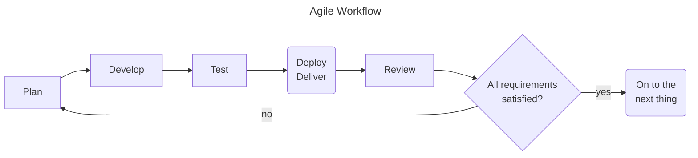
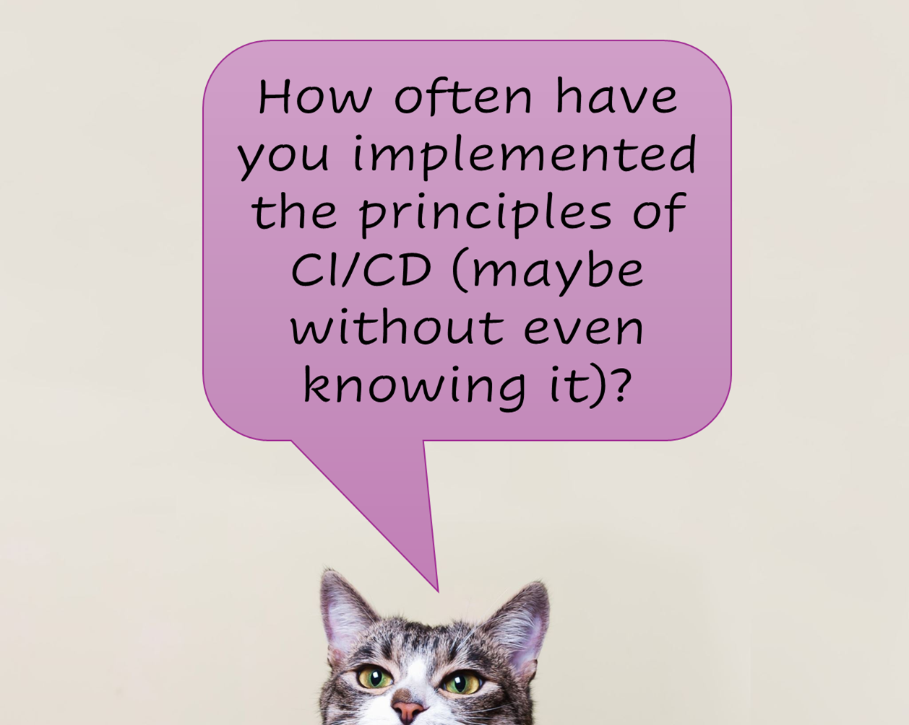

# Overview

## What is CI/CD?

What is [Agile][1]? Agile is an umbrella term used to describe frameworks and best practices that developers use to work together effectively. You may be familiar with some frameworks and practices used in Agile development already: scrum, standup meetings, pair programming, sprints, Kanban. Below is an example of an Agile workflow.

- CI = Continuous Integration: often and sometimes even automatically integrate changes to code
- CD = Continuous Delivery (or Continuous Deployment): Test and deliver, or deploy, code changes as code merges, package releases, etc.

Above can see aspects of [CI/CD][2] in the Agile workflow.

While we normally think of CI/CD with regards to git platforms (e.g GitHub Actions or GitLab Pipelines), it is simply a concept. This concept is a best practice employed by Agile developers to ensure that code is **more regularly** enhanced, tested, and delivered to users. 

## What are the benefits of CI/CD?

- Improves and automates tasks required for collaboration
- Code and dependencies are tested to ensure viability (testing and formatting) and security before being incorporated into production code or systems
- Users/stakeholders get enhancements more regularly

### Common Steps 

1. Audit: Scan code and/or dependencies for security vulnerabilities
2. Lint: Check code for consistent formatting (also type checking for untyped languages)
3. Test: Perform end to end and unit tests
4. Build: Build packages, docker images, etc.
5. Deploy/Deliver: Release package version, push to package or container registry, deploy to system

----
# Slido Poll 1

    

---
# Navigation

[Next --> Tools ](./02-tools.md#tools)

[Previous <-- Intro](./00-intro.md#intro)

[1]: https://www.atlassian.com/agile "This is a non-Federal link"
[2]: https://www.infoworld.com/article/2269266/what-is-cicd-continuous-integration-and-continuous-delivery-explained.html "This is a non-Federal link"
