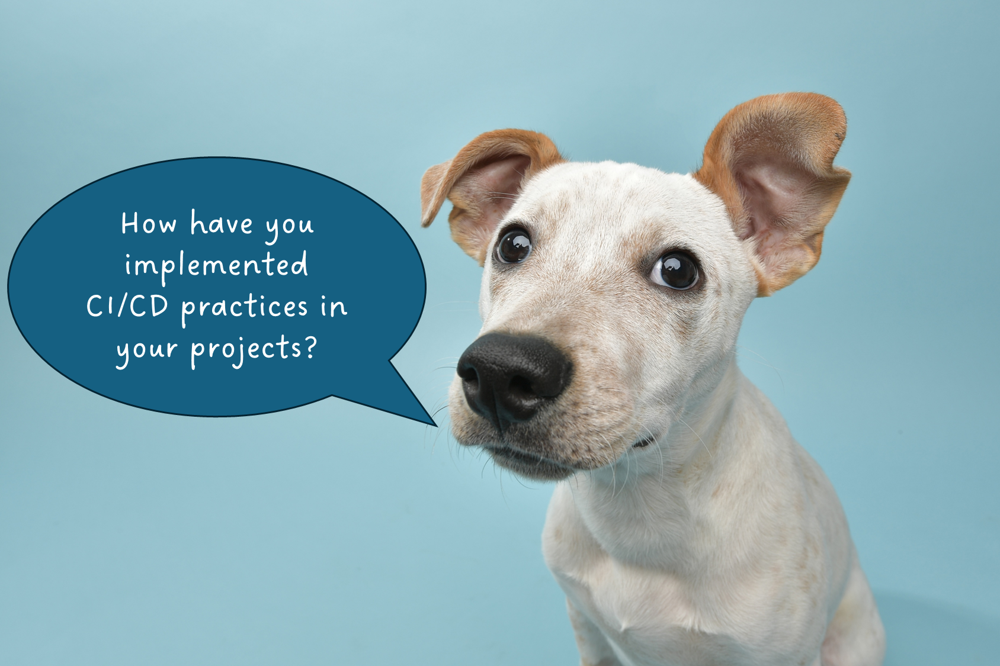

# Implementation

# How Can You Implement CI/CD

Since CI/CD at its core is a set of principles, there are really no rules limiting how you implement it.
> Except for those rules imposed by your organization

Most commonly, developers leverage Git platforms (e.g. GitHub and GitLab) for CI/CD. 

## CI/CD on Git Platforms

> Please review the CDI-Software presentation titled ["Intro to CI/CD with Git Automation"](https://doimspp.sharepoint.com/:v:/r/sites/Software/Meeting%20History/Introduction%20to%20CICD%20with%20Git%20Automation-20250828_110020-Meeting%20Recording.mp4?csf=1&web=1&e=RSFMK4) for more detailed examples of CI/CD in GitHub and GitLab


| | GitHub | GitLab |
|:---:|:---:|:---:|
| **CI/CD<br>Platform** | GitHub Actions | GitLab Pipelines |
| **Configuration<br>Format** | YAML (.github/workflows/*.yml) | YAML (.gitlab-ci.yml) |
| **Command(s)/Action(s)** | Job | Job |
| **Organized Job<br>Set Name** | Workflow | Pipeline |
| **Name of Server<br>Where Jobs Run** | Runner | Runner |


### Basic Syntax Comparison


**[GitHub Job][1]**
```yaml
jobs:
    my-job-name:
        # docker image to run commands in
        runs-on: ubuntu-latest
        # set of commands to run
        steps:
            - name: This is step 1's name
              run: echo "Hello. This is step 1."
            - name: This is step 2's name
              run: echo "Hello. This is step 2."
```

**[GitLab Job][2]**
```yaml
my-job-name:
    # docker image to run commands in
    image: ubuntu-latest
    # set of commands to run
    script:
        - echo "Hello. This is step 1."
        - echo "Hello. This is step 2."
```

> Group of jobs are generally called "stages"

## Local CI/CD

---
>It is equally (if not more) important to set up your local development environment to be able to perform desired CI/CD operations.
---

- Manually run commands in sequence
- Write scripts
- Use built-in scripts
- Utilize git-hooks

----
# Slido Poll 3
<p align="center">
    
</p>

---
# Navigation

[Next --> Hands-on Goal ](./04-hands-on-goal.md#hands-on-goal)

[Previous <-- Tools](./02-tools.md#tools)

[1]: https://docs.github.com/en/actions/how-tos/write-workflows/choose-what-workflows-do/find-and-customize-actions  "This is a non-Federal link"
[2]: https://docs.gitlab.com/ci/jobs/ "This is a non-Federal link"