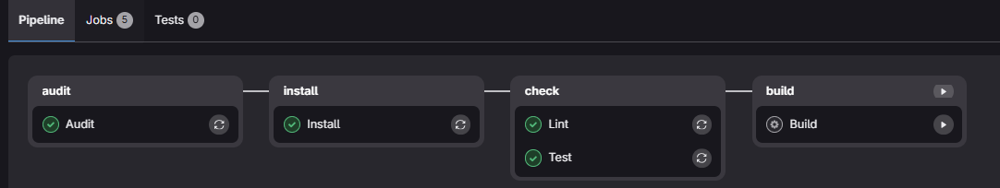
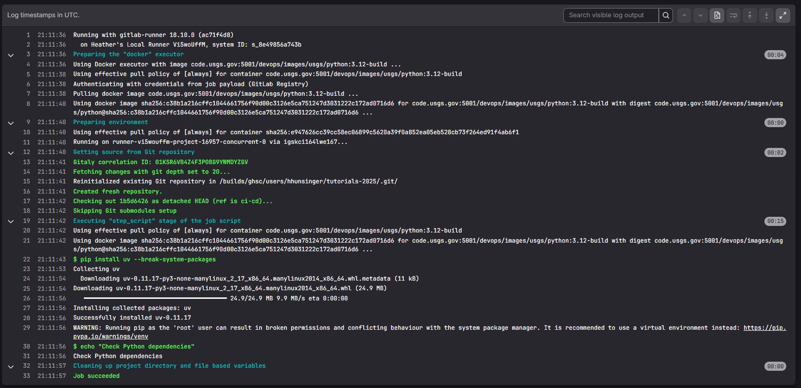

# Hands-on Goal

The goal of the hands-on exercises in this tutorial is to:
1. Setup a local project to:
   1. Audit
   2. Lint
   3. Test
   4. Build
2. Translate what we have completed to a GitLab Pipeline Template

## GitLab Pipeline Skeleton
```yaml
---
# Define default that will be applied to all jobs (can be overridden by job parameters)
default:
  # before each job runs, install uv
  before_script:
    # download and cache data dependencies
    - pip install uv
  # Run all jobs in a Python 3.12 container
  image: code.usgs.gov:5001/devops/images/usgs/python:3.12-build
  # Define the tags that lets the runners know to pickup the job
  tags:
    - local

# Setup when the pipeline will run
workflow:
  # When to run based on git actions
  rules:
    # Run if a new tag is created
    - if: $CI_COMMIT_TAG
    # Run if a new commit is made
    - if: $CI_COMMIT_BRANCH
    # Do not run for merge requests, because it can be a security risk for
    # unreviewed code to run and an upstream project

# Define stages of the pipeline (grouped sets of jobs)
stages:
  - audit
  - install
  - check
  - build

## -------------------------------------
#  Audit Stage
## -------------------------------------

Audit:
  script:
    - echo "Check Python dependencies"
  stage: audit

## -------------------------------------
#  Install Stage
## -------------------------------------

Install:
  script:
    - echo "Install Python dependencies"
  stage: install

## -------------------------------------
#  Check Stage
## -------------------------------------

Lint:
  script:
    - echo "Lint Python code"
  stage: check

Test:
  script:
    - echo "Test Python code"
  stage: check

## -------------------------------------
#  Build Stage
## -------------------------------------

Build:
  rules:
    # Do not run automatically. Require a manual trigger.
    - when: manual
  script:
    - echo "Build Python code"
  stage: build
```
in [.gitlab-ci.yml](../.gitlab-ci.yml)

<details>
  <summary>Example of Skeleton Pipeline Run</summary>

**Pipeline**



**Audit Job**


</details>


---
# Navigation

[Next --> Exercise Setup ](./05-exercise-setup.md#exercise-setup)

[Previous <-- Implementation](./03-implementation.md#implementation)

[1]: https://docs.github.com/en/actions/how-tos/write-workflows/choose-what-workflows-do/find-and-customize-actions  "This is a non-Federal link"
[2]: https://docs.gitlab.com/ci/jobs/ "This is a non-Federal link"