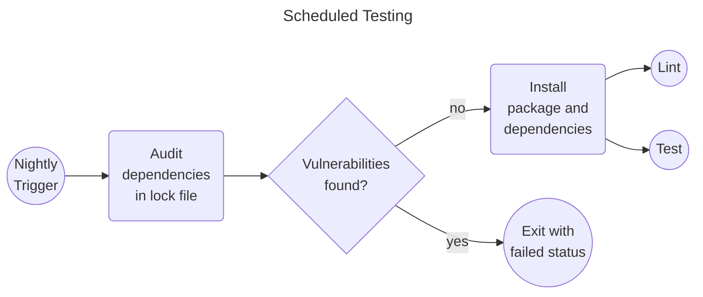
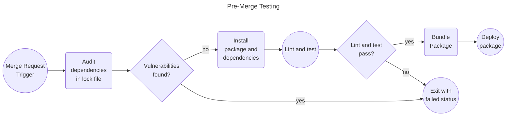

# Audit Exercise

Auditing generally consists of cross referencing dependencies and their version(s) with sources that report known vulnerabilities. These reports can be found in a number of places including but not limited to: [The Common Vulnerabilities and Exposures (CVE) database][1], the U.S. government CISA [Known Vulnerabilities Catalog][2], [GitHub advisories][3], and the National Institute of Standards and Technology (NIST) [National Vulnerability Database][4].

Audits can catch potential security vulnerabilities and prevent them from compromising systems. Regular audits and fixes will also ensure that your project is always moving forward (in terms of versions of dependencies and the base language).

----
### Example: The Shai Hulud Incident(s)

In late 2025 a number of security vulnerabilities were detected that impacted commonly used dependencies distributed by Node Package Manager (NPM). The widespread use of these packages meant that over [500 packages were compromised][3]. The self replicating, credential harvesting, worm(s) that compromised these packages between September 2025 - December 2025 were called:
- [Shai-Hulud 1.0][5]
- [Shai-Hulud 2.0][6]
- [Mini Shai-Hulud][7]


#### How CI/CD could catch/prevent this?
CI/CD workflows can/should consist of regular (sometimes scheduled) audit checks. These audit checks scan packages for vulnerabilities reported by data sources such as the [GitHub Advisory Database][7] and [Common Vulnerabilities and Exposure (CVE) Program][8]. Example of a CI/CD workflow that could prevent this.






## Auditing the Current Environment
Some package managers include their own audit tools. Example: `npm audit` and `uv audit`.

`uv audit` examines the uv.lock and checks for known vulnerabilities. 

> NOTE: `uv audit` is experimental, but it appears not to require installing packages in order to audit them like other auditors like `pip-audit` do. Instead it looks at the lock file. Why could this be important?

<details>
  <summary>Run the Audit</summary>
  
1. Run an audit on the current files: `uv audit`
   - Examine the output vulnerabilities
2. Try ignoring a vulnerability: `uv audit --ignore PYSEC-2026-141`
   - The listed vulnerability is no longer in the output report
  
</details>

## Fix the audit issue and install


<details>
  <summary>Fix and Install</summary>


1. Remove the requirement version constraint that is causing the vulnerability with `requests` in the pyproject.toml: `<2.31.0`
2. Update the lock file: `uv lock --upgrade`
3. Rerun the audit: `uv audit`
4. Install dependencies: `uv sync` 
  - This step makes sure that the virtual environment is in sync with the defined dependencies in the pyproject.toml and creates a uv.lock file and the virtual environment (.venv folder) if they don't exist
  
</details>

## Running Commands in the Virtual Environment

Our dependencies are not installed at the system level. They are installed in the newly created .venv folder. What happens when you run `hello`?

<details>
  <summary>Commands in a virtual environment</summary>

There are two ways to run code in a virtual environment. You can activate the environment with `source .venv/bin/activate`. If you are using an IDE like VSCode it may have automatically run for you, and the command `hello` worked. If not you can mandate that you are running inside the virtual environment by prepending `uv run` to the command: `uv run hello`. This `run` syntax might look familiar; it is also used in the Poetry package manager (`poetry run`) and Node Package Manager (`npm run`). From this point on we will us `uv run` so that we are all working though the tutorial consistently.

</details>


## Setting up the GitLab Pipeline Jobs for Audit and Install
### Audit
Take a moment to update your .gitlab-ci.yml Audit job.

<details>
  <summary>Template Changes Part</summary>

```diff 
Audit:
  script:
    - echo "Check Python dependencies"
+   - uv audit
  stage: audit
```
> Why don't we need to run `uv lock` here?

</details>

### Install
Take a moment to update your .gitlab-ci.yml Install job.

<details>
  <summary>Template Changes Part 1</summary>

##### Running the install
```diff 
## -------------------------------------
#  Install Stage
## -------------------------------------

Install:
  script:
    - echo "Install Python dependencies"
+   - uv sync
  stage: install
```
> With what we know about how jobs run in docker container, what would happen to the next job if we leave the install step as is?


<details>
  <summary>Template Changes Part 2</summary>

##### Running the install
```diff 
## -------------------------------------
#  Install Stage
## -------------------------------------

Install:
+ artifacts:
+   expire_in: 1 week
+   paths:
+     - .venv
  script:
    - echo "Install Python dependencies"
+   - uv sync
  stage: install
```

</details>

</details>


---
# Navigation

[Next --> Lint Exercise ](./07-lint-exercise.md#lint-exercise)

[Previous <-- Exercise Setup](./05-exercise-setup.md#exercise-setup)


[1]: https://www.cve.org/ "This is a non-Federal link"
[2]: https://www.cisa.gov/known-exploited-vulnerabilities-catalog "This is a non-Federal link"
[3]: https://github.com/advisories "This is a non-Federal link"
[4]: https://nvd.nist.gov/vuln "This is a non-Federal link"
[5]: https://www.stepsecurity.io/blog/ctrl-tinycolor-and-40-npm-packages-compromised "This is a non-Federal link"
[6]: https://www.cisa.gov/news-events/alerts/2025/09/23/widespread-supply-chain-compromise-impacting-npm-ecosystem
[7]: https://www.microsoft.com/en-us/security/blog/2025/12/09/shai-hulud-2-0-guidance-for-detecting-investigating-and-defending-against-the-supply-chain-attack/ "This is a non-Federal link"