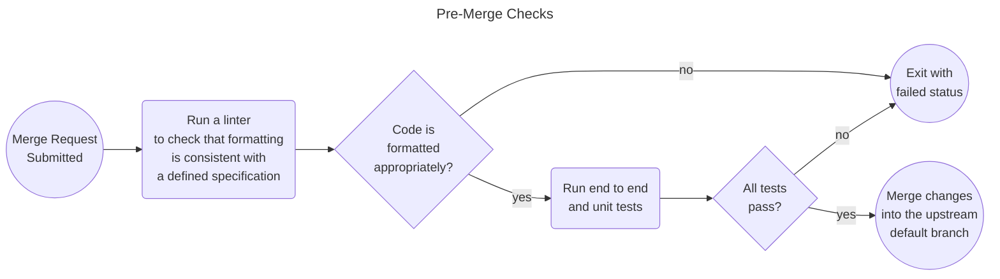

# Lint Exercise

Linting ensures that packages are consistently formatted and required specifications are met. 

----
### Example

Consider a scenario where you and your colleague are working on the same code file at the same time. Rebasing changes with Git is one headache you may encounter, but you may also encounter differences in how you format the code or how your changes impact each other's tests. For example:

1. Developer 1 and 2 are simultaneously working on different changes in the same file in a project: my_module.py
2. Developer 1 submits a merge request which is merged
3. Developer 2 rebases their feature branch, completes their changes and submits a merge request which is merged
4. Developer 3 goes to work on the project and gets the latest changes
5. Developer 3 notices some strange things in my_module.py
   1. Developer 1 used single quotes for strings and Develop 2 used double quotes for strings
   2. Developer 2 updated a function and the expected argument type is now inconsistent with how Developer 1's changes are utilizing the function

#### How CI/CD could catch/prevent this?

Prior to merging changes into a shared repository, all testing and linting could/should be required to pass.




In this example we will use three linting packages:

1. black: can be used to check and fix formatting
2. isort: can be used to check and fix package import organization
3. mypy: checks types and type mismatches for variables, functions, etc. based upon type hints.

**Example of type mismatch that mypy would catch**:

```python
def format_name(firstname: str, middlename: str, lastname: str):
  return f"{lastname}, {firstname} {middlename}"
  
if __name__ == "__main__":
    format_name(firstname='Heather', middlename=3, lastname='Hunsinger')
```


<details>
  <summary>Lint the helloworld package</summary>
  
1. Check that imports are sorted correctly: `uv run isort . --check`
2. Check that the file is formatted correctly: `uv run black . --check`
3. Check that the types are set correctly: `uv run mypy helloworld --strict`

> NOTE: If you aren't in the project directory replace `.` with the path to the project.
</details>

## Setting up the GitLab Pipeline Jobs for Linting
Take a moment to update your .gitlab-ci.yml Lint job.

<details>
  <summary>Template Changes</summary>

```diff 
Lint:
  script:
    - echo "Lint Python code"
+   - uv run isort . --check
+   - uv run black . --check
+   - uv mypy helloworld --strict
  stage: check
```
</details>

---
# Navigation

[Next --> Test Exercise](./08-test-exercise.md#test-exercise)

[Previous <-- Audit Exercise](./06-audit-exercise.md#audit-exercise)