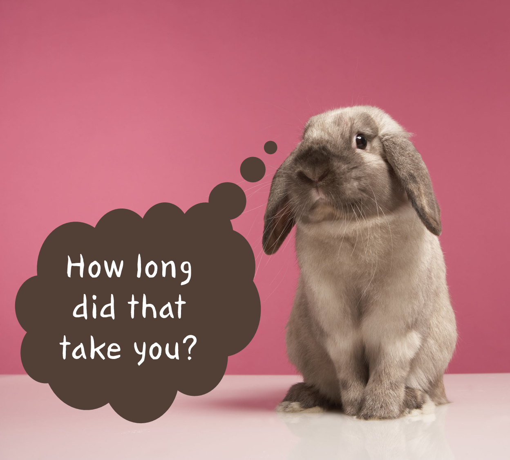

# Run All Checks

**Say that we have changed the code and want to prepare it for distribution.** Run all the steps performed from [Audit](./06-audit-exercise.md) to [Build](./09-build-exercise.md). At first try doing it without looking back. **Take a look at the timer and take note of the time when you finish.**

  
Exercise Steps

  
1. uv audit
2. uv run isort . --check
3. uv run black . --check
4. uv run mypy helloworld --strict
5. uv run pytest --cov hellowworld
6. uv run coverage xml
7. uv build
  

----
# Slido Poll 4

    

---
# Navigation

[Next --> Tasks Exercise](./11-tasks-exercise.md#tasks-exercise)

[Previous <-- Build Exercise](./09-build-exercise.md#build-exercise)