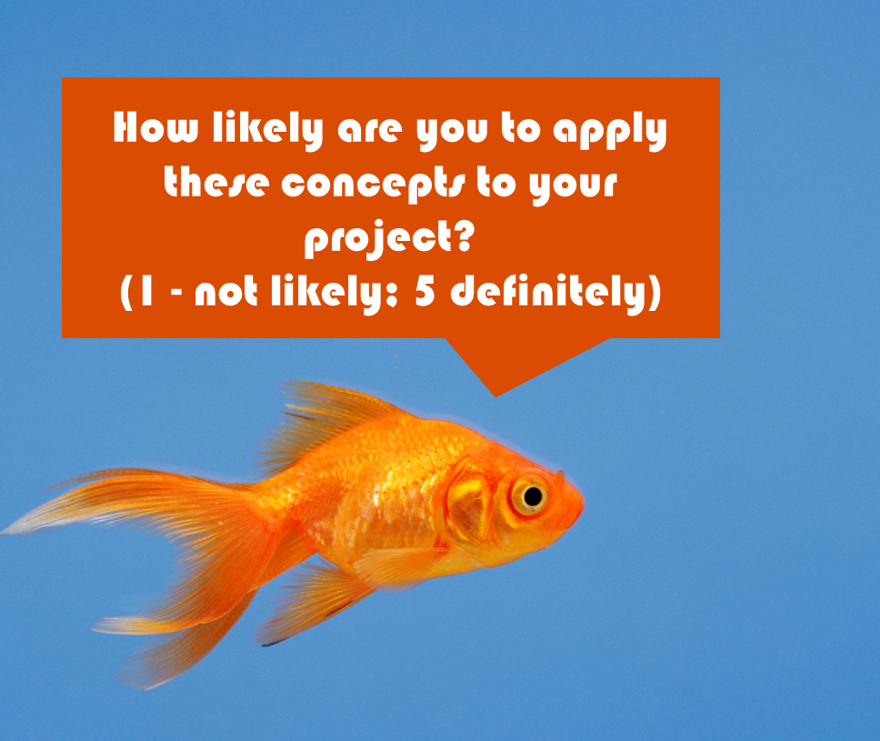

# Final Pipeline


```yaml
---
# Define default that will be applied to all jobs (can be overridden by job parameters)
default:
  # before each job runs, install uv
  before_script:
    # download and cache data dependencies
    - pip install uv --break-system-packages
  # Run all jobs in a Python 3.12 container
  image: code.usgs.gov:5001/devops/images/usgs/python:3.12-build
  # Define the tags that lets the runners know to pickup the job
  tags:
    - local

# Setup when the pipeline will run
workflow:
  # When to run based on git actions
  rules:
    # Run if a new tag is created
    - if: $CI_COMMIT_TAG
    # Run if a new commit is made
    - if: $CI_COMMIT_BRANCH
    # Do not run for merge requests, because it can be a security risk for
    # unreviewed code to run and an upstream project

# Define stages of the pipeline (grouped sets of jobs)
stages:
  - audit
  - install
  - check
  - build

## -------------------------------------
#  Audit Stage
## -------------------------------------

Audit:
  script:
    - echo "Check Python dependencies"
    - uv audit
  stage: audit

## -------------------------------------
#  Install Stage
## -------------------------------------

Install:
  artifacts:
    expire_in: 1 week
    paths:
      - .venv
  script:
    - echo "Install Python dependencies"
    - uv sync
  stage: install

## -------------------------------------
#  Check Stage
## -------------------------------------

Lint:
  script:
    - echo "Lint Python code"
    - uv run poe lint
  stage: check

Test:
  script:
    - echo "Test Python code"
    - uv run poe test
  stage: check

## -------------------------------------
#  Build Stage
## -------------------------------------

Build:
  artifacts:
    expire_in: 1 week
    paths:
      - dist/*
  rules:
    # Do not run automatically. Require a manual trigger.
    - when: manual
  script:
    - echo "Build Python code"
    - uv build
  stage: build

```

----
# Slido Poll 5

<p align="center">
    
</p>


---
# Navigation

[Previous <-- Git Hooks Exercise](./12-git-hooks-exercise.md#git-hooks-exercise)