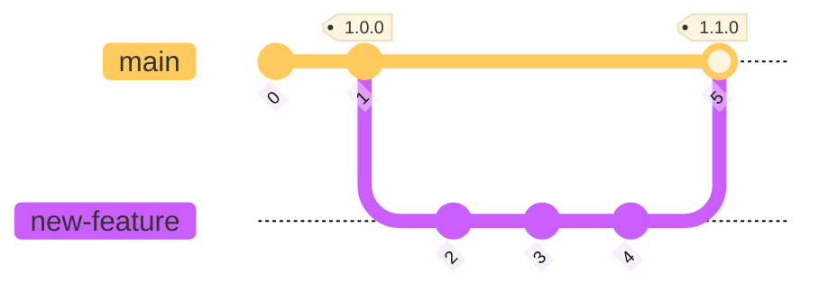
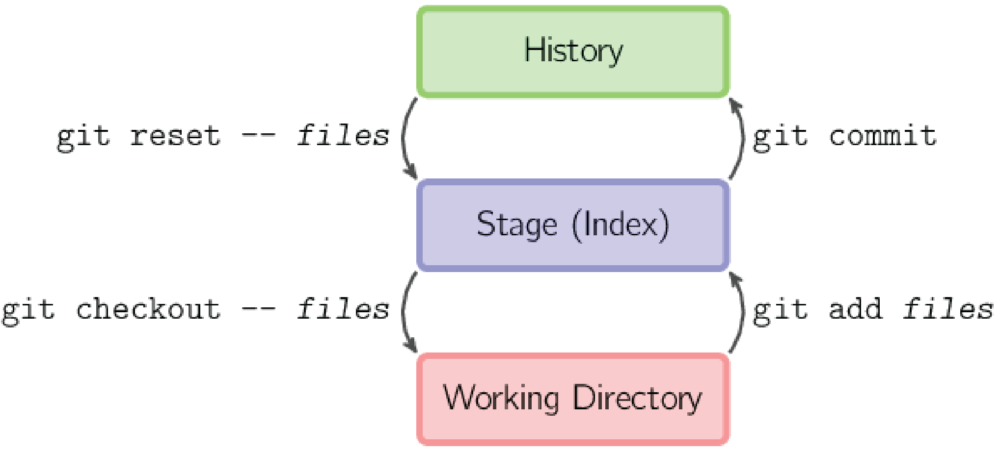

# Git branches, commits, and history

As mentioned in [What is Git](./what-is-git.md#branches), *branches* are references that can be
used to organize your work and to separate development code from stable code. Though there are any
number of schemes, workflows, and naming conventions, for the purposes of this tutorial, we'll call
the stable branch `main`, with arbitrary branch names for new features or bug fixes.



In the figure above, the `main` branch is stable code, from which tags are created. After some work
on a `new-feature` *branch*, three *commits*, the functional new feature is incorporated back into
the `main` branch (this is called a *merge*, which we'll get to later).

## Creating and switching branches

Git offers a number of ways to create a new branch and use it. You may hear the terms *switch* or
*checkout* to refer to changing your working directory to the tip of a target *branch* - these
terms are interchangeable. The `git branch` command can, among other things, create new branches,
and list, modify, or delete existing branches. Let's create a new branch, list the branches, and
then *switch* to it (we could also *checkout* the new branch with `git checkout`)

```bash
(main=) $ git branch -c new-feature

(main=) $ git branch
* main
  new-feature

(main=) $ git switch new-feature
Switched to branch 'new-feature'
Your branch is up to date with 'origin/main'.

(new-feature=) $ 
```

Though the act of creating a branch is separate from *switching* to it (or *checking* it out), you
can do this with a single command. Here are two one-line commands that replace the `git branch -c`
and `git switch` commands above (presuming you're on the main branch):

- `git switch -c new-feature`
- `git checkout -b new-feature`

> [!Note]
> When you create a new branch with the commands above, the new branch reference points to the same
> *commit* as the branch you were on when you created the new branch. Of course, there are ways to
> specify a different *start point*, but we won't cover that here (see `<start-point>` in
> `git help branch` or `git help switch`).

## Commit already

Once you've done some work - created or modified one or more files you'll want to *commit* these to
your repository. The first step is to move your work from the *working directory* to *staging* (or
the *index*) and then, once you've completed some work, you *commit* the *staged* changes to the *history*.

### Adding a new file

If you create a new file, it is *untracked* until you add it:

```bash
(new-feature %) $ touch new-file.txt

(new-feature %) $ git status
On branch new-feature
Untracked files:
  (use "git add <file>..." to include in what will be committed)
        new-file.txt

nothing added to commit but untracked files present (use "git add" to track)

(new-feature %) $ git add new-file.txt

(new-feature %) $ git status
On branch new-feature
Changes to be committed:
  (use "git restore --staged <file>..." to unstage)
        new file:   new-file.txt
```

It is possible to add only some of the changes in an individual file, see
[Further Topics: `git add -p`](further-topics.md#git-add--p).

---

*<details><summary>Moving between Git areas</summary>*

The figure below shows the Git commands that move files from one area to another.

|     |
|:---:|
|  |
| *Basic Usage (source: [A Visual Git Reference][visual-git-ref], Mark Lodato)* |

[visual-git-ref]: https://marklodato.github.io/visual-git-guide/index-en.html#basic-usage "This is a non-Federal link"

</details>

---

### Make history

*Staged* files are added to the *history* with the `git commit` command. *Commits* have concise
messages describing the contents and purpose of the commit (unless you wish to face the wrath of
your collaborators or future self). For a useful discussion of what should go into a commit
message, see [How to Write a Git Commit Message][write-commit].

 <https://xkcd.com/1296>

*Commit* a file with a message using `git commit -m` as follows:

```bash
(new-feature %) $ git commit -m 'add new file'
[new-feature f66c014] adding new file
 1 file changed, 0 insertions(+), 0 deletions(-)
 create mode 100644 new-file.txt
```

*<details><summary>Configuring a default editor</summary>*

For longer commit messages, where `git commit -m` is inconvenient, you can configure a default
editor with `git config`, see the `core.editor` section of the [Pro Git book][core-editor]

</details>

[write-commit]: https://cbea.ms/git-commit/?hl=en "This is a non-Federal link"
[core-editor]: https://git-scm.com/book/en/v2/Customizing-Git-Git-Configuration#_core_editor?hl=en "This is a non-Federal link"

### Making changes

More often than not, you'll be changing existing files, so let's see what this looks like.

```bash
(new-feature) $ echo "Hello" >> new-file.txt

(new-feature *) $ git status
On branch new-feature
Changes not staged for commit:
  (use "git add <file>..." to update what will be committed)
  (use "git restore <file>..." to discard changes in working directory)
        modified:   new-file.txt

no changes added to commit (use "git add" and/or "git commit -a")
```

Let's see what changed with `git diff`:

```bash
(new-feature *) $ git diff
diff --git a/new-file.txt b/new-file.txt
index e69de29..e965047 100644
--- a/new-file.txt
+++ b/new-file.txt
@@ -0,0 +1 @@
+Hello
```

And now let's prepare a commit. Note that after adding the changes, `git diff` will no longer show
those changes. This is because you've moved the existing changes from your *working directory* to *staging*, so to
see the *staged* changes, you'll need to use `git diff --staged`.

```bash
(new-feature *) $ git add new-file.txt

(new-feature +) $ git status
On branch new-feature
Changes to be committed:
  (use "git restore --staged <file>..." to unstage)
        modified:   new-file.txt

(new-feature +) $ git diff

(new-feature +) $ git diff --staged
diff --git a/new-file.txt b/new-file.txt
index e69de29..e965047 100644
--- a/new-file.txt
+++ b/new-file.txt
@@ -0,0 +1 @@
+Hello

(new-feature +) $ git commit -m 'adding hello'
[new-feature 1c48b3c] adding hello
 1 file changed, 1 insertion(+)

(new-feature) $ git status
On branch new-feature
nothing to commit, working tree clean
```

## Checking the log

The Git history

```bash
(new-feature) $ git log
commit 1c48b3c9edb602c6e77f9acc1f355c4b8fadea0b (HEAD -> new-feature)
Author: Gandalf <gtg@middleearth.net>
Date:   Tue May 27 11:30:02 2025 -0600

    adding hello

commit f66c0148c0234b5100596975c92c52df61c6b575
Author: Gandalf <gtg@middleearth.net>
Date:   Tue May 27 10:19:08 2025 -0600

    adding new file
```

## Try it out

Exercise 2: [branching and commits](./ex2-local-branch-and-commit.md)

---

## Navigation

- [**Tutorial Index**](./README.md#tutorial-outline)
- Previous --> [Git going](./git-going.md)
- [Exercise 2 - branching and commits](./ex2-local-branch-and-commit.md)
- Next --> [Pulling it together - merging and rebasing](./merging-and-rebasing.md)

---
