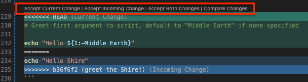

# Exercise 3: merge and rebase

Background information: [Pulling it together - merging and rebasing](./merging-and-rebasing.md)

## Exercise 3 Goals

- Build on [Exercise 2](./ex2-local-branch-and-commit.md)
- Use `git fetch` to download changes and branches from a remote repository
- Use `git pull` to merge changes from a remote branch into a local branch
- Resolve Git merge conflicts
- Use `git rebase` to rebase branch on another branch
- Delete a working branch after it has been merged

## The exercise

In the exercise, we're going to modify file `hello.sh` in the `git-basics` directory, so let's
change into this directory (`cd git-basics`). Note that this file does not yet exist in your
working directory. To get the file, we need to checkout a copy of the feature branch that does have
it. Depending on whether the feature branch existed when you cloned the repository, the branch may
or may not already exist in your local clone. Run `git fetch` to get it.

> [!NOTE]
> The Git identifiers in the examples and solutions below will likely be different from what you
> see in your terminal.

```bash
tutorials-2025 (main=) $ git remote -v
origin  https://code.usgs.gov/cdi/cdi-software/tutorials-2025.git (fetch)
origin  https://code.usgs.gov/cdi/cdi-software/tutorials-2025.git (push)

git-basics (main=) $ git fetch
remote: Enumerating objects: 6, done.
remote: Counting objects: 100% (6/6), done.
remote: Compressing objects: 100% (3/3), done.
remote: Total 4 (delta 2), reused 2 (delta 0), pack-reused 0 (from 0)
Unpacking objects: 100% (4/4), 358 bytes | 119.00 KiB/s, done.
From https://code.usgs.gov/cdi/cdi-software/tutorials-2025
 * [new branch]      demo-feature-branch -> origin/demo-feature-branch
```

If the remote feature branch has already been downloaded to your local repository (i.e. it existed
when you cloned the repository), `git fetch` will not print any output.

### Step 1 - checkout a local working branch based on the feature branch

Fetch the remote `demo-feature-branch`, create a local working branch from it, and make this new
branch your current branch.

<details><summary>Solution</summary>

```shell
git-basics (main=) $ git fetch origin demo-feature-branch:demo-feature-branch 
From https://code.usgs.gov/cdi/cdi-software/tutorials-2025
 * [new branch]      demo-feature-branch -> demo-feature-branch

git-basics (main=) $ git switch demo-feature-branch
Switched to branch 'demo-feature-branch'

git-basics (demo-feature-branch) $ git switch -c modify-feature-branch
Switched to a new branch 'modify-feature-branch'

git-basics (modify-feature-branch) $ git branch -a -v
  demo-feature-branch                a56954d add hello script
  main                               784fad6 Merge branch 'update-figs' into 'main'
* modify-feature-branch              a56954d add hello script
  remotes/origin/HEAD                -> origin/main
  remotes/origin/demo-feature-branch a56954d add hello script
  remotes/origin/main                784fad6 Merge branch 'update-figs' into 'main'
```

> [!NOTE]
> The `:` in the `git fetch` command (`SRC:DEST`) allows you to specify both the source branch and
> the destination branch. In the example above, Git finds the remote branch named
> `demo-feature-branch` and creates a local branch named `demo-feature-branch`.

</details><br>

You should now see file `hello.sh` in the `git-basics` directory (use the `ls` command to list the
files in the `git-basics` directory, presuming you are in this directory). Run this script
(`./hello.sh`) and it will print "Hello World" in your terminal.

*<details><summary>Running shell scripts</summary>*

> [!NOTE]
> To run a shell script in bash, a script file can be made *executable* by running the command
> `chmod +x hello.sh`. Then run it by specifying the path to the script file which, if it is in your
> working directory, means prepending "./" to the filename:
>
> ```bash
> git-basics (modify-feature-branch=) $ ./hello.sh 
> Hello World
> ```

</details>

### Step 2 - modify `hello.sh` and add this to the Git history

Change the `hello.sh` script greeting and add this change to the Git history.

<details><summary>Solution</summary>

In your favorite editor, change the greeting, e.g. "Hello Earth", and save the file. File
`hello.sh` is now *modified* (`git status`) and we can see the changes with `git diff`. To include
this change in the Git history, we need to *staged* (`git add`) the file before we *commit*
(`git commit -m '...'`) the changes.

```bash
git-basics (modified-feature-branch *=) $ sed -i '' 's/World/Shire/' hello.sh

git-basics (modified-feature-branch *=) $ git status
On branch modified-feature-branch
Your branch is up to date with 'origin/demo-feature-branch'.

Changes not staged for commit:
  (use "git add <file>..." to update what will be committed)
  (use "git restore <file>..." to discard changes in working directory)
        modified:   hello.sh

no changes added to commit (use "git add" and/or "git commit -a")

git-basics (modified-feature-branch *=) $ git diff
diff --git a/git-basics/hello.sh b/git-basics/hello.sh
index 23bf47c..1b0c314 100755
--- a/git-basics/hello.sh
+++ b/git-basics/hello.sh
@@ -1,3 +1,3 @@
 #!/bin/bash
 
-echo "Hello World"
+echo "Hello Shire"

git-basics (modified-feature-branch *=) $ git add hello.sh

git-basics (modified-feature-branch +=) $ git commit -m 'greet the Shire!'
[modified-feature-branch b9e4413] greet the earth
 1 file changed, 1 insertion(+), 1 deletion(-)

git-basics (modified-feature-branch>) $ git status
On branch modified-feature-branch
Your branch is ahead of 'origin/demo-feature-branch' by 1 commit.
  (use "git push" to publish your local commits)

nothing to commit, working tree clean

git-basics (modify-feature-branch) $ git blame hello.sh
a56954d5 (Jason Altekruse 2025-06-04 15:36:46 -0600 1) #!/bin/bash
a56954d5 (Jason Altekruse 2025-06-04 15:36:46 -0600 2) 
5c2957db (Frodo           2025-06-05 11:28:40 -0600 3) echo "Hello Shire"
```

</details>

### Step 3 - Update local working branch with changes from remote

An important update has been merged into the remote branch - incorporate those changes into your
local feature branch (not your working branch, yet).

<details><summary>Solution</summary>

First we need to switch to the local `demo-feature-branch` and then *pull* down the changes from
the remote branch with `git pull`. In this case, since we don't need to pull from the *main*
(default) branch, we also need to specify the *remote* and target *

```shell
git-basics (modify-feature-branch) $ git switch demo-feature-branch
Switched to branch 'demo-feature-branch'

git-basics (demo-feature-branch) $ git pull origin demo-feature-branch 
From https://code.usgs.gov/cdi/cdi-software/tutorials-2025
 * branch            demo-feature-branch -> FETCH_HEAD
Updating a56954d..e665ffe
Fast-forward
 git-basics/hello.sh | 5 ++++-
 1 file changed, 4 insertions(+), 1 deletion(-)

git-basics (demo-feature-branch) $ ./hello.sh 
Hello Middle Earth
```

</details>

### Step 4 - Rebase working branch on the updated feature branch

Now that we have the updates on our local feature branch, we need to incorporate those changes into
our working branch. *Rebase* the local working branch on the updated feature branch.

<details><summary>Solution</summary>

```shell
git-basics (demo-feature-branch) $ git switch modify-feature-branch
Switched to branch 'modify-feature-branch'

git-basics (modify-feature-branch) $ git rebase demo-feature-branch 
Auto-merging git-basics/hello.sh
CONFLICT (content): Merge conflict in git-basics/hello.sh
error: could not apply b36f6f2... greet the Shire!
hint: Resolve all conflicts manually, mark them as resolved with
hint: "git add/rm <conflicted_files>", then run "git rebase --continue".
hint: You can instead skip this commit: run "git rebase --skip".
hint: To abort and get back to the state before "git rebase", run "git rebase --abort".
Could not apply b36f6f2... greet the Shire!

git-basics (modify-feature-branch *+|REBASE-i 1/1) $ git status
interactive rebase in progress; onto 20b3a24
Last command done (1 command done):
   pick b36f6f2 greet the Shire!
No commands remaining.
You are currently rebasing branch 'modify-feature-branch' on '20b3a24'.
  (fix conflicts and then run "git rebase --continue")
  (use "git rebase --skip" to skip this patch)
  (use "git rebase --abort" to check out the original branch)

Unmerged paths:
  (use "git restore --staged <file>..." to unstage)
  (use "git add <file>..." to mark resolution)
        both modified:   hello.sh

no changes added to commit (use "git add" and/or "git commit -a")
```

We've hit a merge conflict when our *rebase* tried to apply our working branch commit because Git
can't tell how to apply it to the updated feature branch. If we print the contents of `hello.sh`
using the shell command `cat`, we see that the *rebase* operation adds the conflicting lines to the
file:

```shell
git-basics (modify-feature-branch *+|REBASE-i 1/1) $ cat hello.sh 
#!/bin/bash

<<<<<<< HEAD
# Greet first argument to script, defualt to "Middle Earth" if none specified

echo "Hello ${1:-Middle Earth}"
=======
echo "Hello Shire"
>>>>>>> b36f6f2 (greet the Shire!)
```

The "current change", between lines `<<<<<<< HEAD` and `=======`, shows the lines from the updated
feature branch. The "incoming change", between lines `=======` and
`>>>>>>> ...` (the end of the line will include your commit ID and message), shows the changes on
your local working branch. We need to manually edit this file in an editor to tell Git how to
apply our change. VSCode can display the conflicted file with links to accept the current change,
the incoming change, or both (red box in the figure below). Or we can manually edit the file to
resolve the conflict.



Once we resolve the conflict by changing the default greeting to our own, we follow the
instructions in the `git rebase` output, which say to *add* the resolved file and then running
`git rebase --continue`. The latter will prompt you to modify the message for the conflicted
commit if you'd like.

```shell
git-basics (modify-feature-branch *+|REBASE-i 1/1) $ cat hello.sh 
#!/bin/bash

# Greet first argument to script, defualt to "Middle Earth" if none specified

echo "Hello ${1:-Shire}"

git-basics (modify-feature-branch *+|REBASE-i 1/1) $ git add hello.sh

git-basics (modify-feature-branch +|REBASE-i 1/1) $ git status
interactive rebase in progress; onto 20b3a24
Last command done (1 command done):
   pick b36f6f2 greet the Shire!
No commands remaining.
You are currently rebasing branch 'modify-feature-branch' on '20b3a24'.
  (all conflicts fixed: run "git rebase --continue")

Changes to be committed:
  (use "git restore --staged <file>..." to unstage)
        modified:   hello.sh


git-basics (modify-feature-branch +|REBASE-i 1/1) $ git rebase --continue
[detached HEAD 5641136] greet the Shire! by default
 1 file changed, 1 insertion(+), 1 deletion(-)
Successfully rebased and updated refs/heads/modify-feature-branch.
```

You can see who last edited each line of `hello.sh` with `git blame hello.sh`:

TODO: What does a clean git show: is the output piped through `less` or printed to screen?

```shell
git-basics (modify-feature-branch) $ git blame hello.sh
916670d8 (Bilbo   2025-06-05 17:33:20 -0600 1) #!/bin/bash
916670d8 (Bilbo   2025-06-05 17:33:20 -0600 2) 
f1bcd57f (Gandalf 2025-06-05 17:33:46 -0600 3) # Greet first argument to script, defualt to "Middle Earth" if none specified
f1bcd57f (Gandalf 2025-06-05 17:33:46 -0600 4) 
56411366 (Frodo   2025-06-05 17:37:31 -0600 5) echo "Hello ${1:-Shire}"
```

</details>

### Step 5 - Merge your update feature into main

Now that our local working branch changes have been *rebased* on the updated feature branch, we
want to incorporate our work into the *main* branch. For the purposes of the tutorial, we'll do
this locally rather than, within the context of a *forking workflow*, pushing our working branch
to our *fork* and creating a *merge request* from there to the *main* branch in the *upstream*
repository.

<details><summary>Solution</summary>

```shell
git-basics (modify-feature-branch) $ git switch main
Switched to branch 'main'
Your branch is up to date with 'origin/main'.

git-basics (main=) $ git merge modify-feature-branch 
Updating 784fad6..5641136
Fast-forward
 git-basics/hello.sh | 5 +++++
 1 file changed, 5 insertions(+)
 create mode 100755 git-basics/hello.sh

git-basics (main>) $ ./hello.sh 
Hello Shire

git-basics (main>) $ ./hello.sh "Baggins, Took, and Brandybuck"
Hello Baggins, Took, and Brandybuck
```

</details>

### Step 6 - Wrap up

You've finished work on your modified feature, so clean up your now redundant working branch (the
working branch points to the same commit as `main`, so we no longer need it).

<details><summary>Solution</summary>

```shell
git-basics (main>) $ git branch -a -v
  demo-feature-branch                20b3a24 Merge branch 'demo-feature-branch' into 'demo-feature-branch'
* main                               5641136 [ahead 4] greet the Shire! by default
  modify-feature-branch              5641136 greet the Shire! by default
  remotes/origin/HEAD                -> origin/main
  remotes/origin/demo-feature-branch 20b3a24 Merge branch 'demo-feature-branch' into 'demo-feature-branch'
  remotes/origin/main                784fad6 Merge branch 'update-figs' into 'main'

git-basics (main>) $ git branch -d modify-feature-branch 
Deleted branch modify-feature-branch (was 5641136).
```

If you're working within a *forking workflow* and your *merge request* (GitLab) or *pull request*
(GitHub) has been merged, your working branch on your fork can also be deleted (there is often an
option to delete the remote branch when the *merge/pull request* is merged), update your local
repository to reflect the deleted remote branch with `git fetch --all --prune`.

</details>

---

## Navigation

- [**Tutorial Index**](./README.md#tutorial-outline)
- Previous --> [Exercise 2](./ex2-local-branch-and-commit.md)
- Next --> [TODO](TODO)

---
