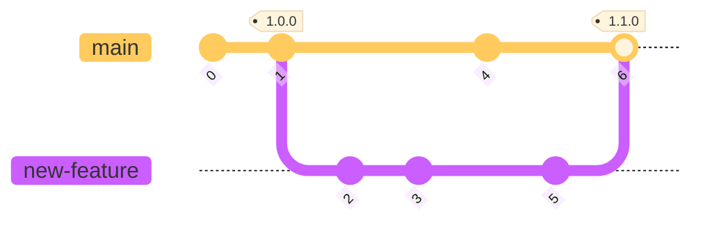
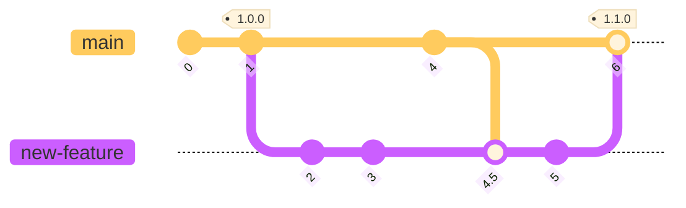
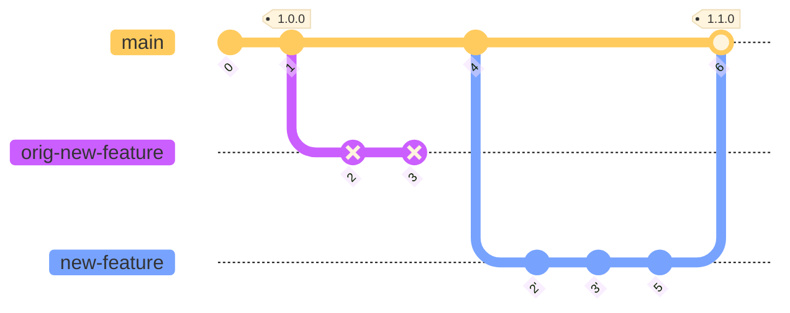

# Pulling it together - merging and rebasing

We've seen how to use *branches* to organize work and keep development separate from stable code.
Changes on a branch can then be *merged* back into the `main` branch. Particularly if you're
working alone, this is usually a fairly simple process. Complications can arise once you start
collaborating and want to incorporate changes that someone else implemented on another branch or
merged into the `main` branch since you began working on your branch.

## Merge

A Git *merge* combines changes from one branch into another, creating a commit with two parents. In
the diagram below, the merge commit is commit `6` (tagged `1.1.0`). It has two parents, commits `4`
and `5`.

In the example above, let's say merge `4`, on `main`, is from a collaborator and is unrelated to
your work on `new-feature` (or a different chapter of a report). It may not be necessary for you to
incorporate commit `4` into your branch because it is unrelated.

On the other hand, maybe commit `4` includes a new parameter used by your new feature and in other
parts of the code, so you do need to incorporate it into your branch. There's nothing wrong with
doing this using `git merge`, but it can lead to "messy" or "cluttered" git histories. Git *rebase*
can clean this up (with a cost...).

## Rebase

Rebasing applies the incremental changes on one branch to another as a series of new commits. This
creates a "cleaner" history, but does change the history as the original commits are recreated as
if they occurred after commit `4` (commits `2'` and `3'`). This can cause problems if, for example,
a collaborator branched off of your work at one of those original commits.

## Try it out

Exercise 3: [merge and rebase](./ex3-merge-and-rebase.md)

---

## Navigation

- [**Tutorial Index**](../README.md#tutorial-outline)
- Previous --> [TODO](TBD)
- [Exercise 3 - merge and rebase](./ex3-merge-and-rebase.md)
- Next --> [TODO](TBD)

---
