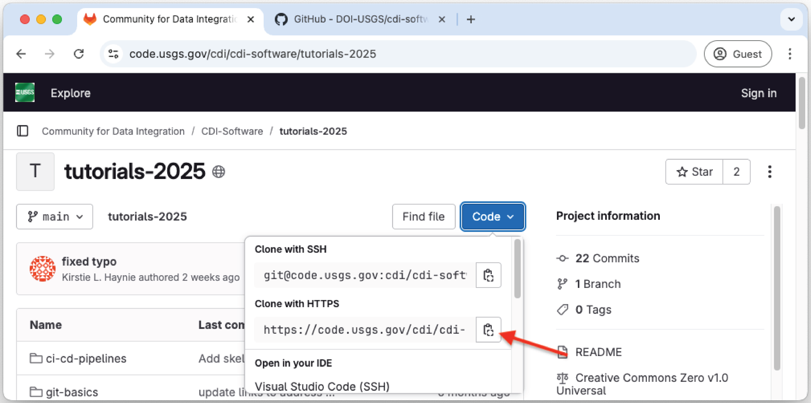
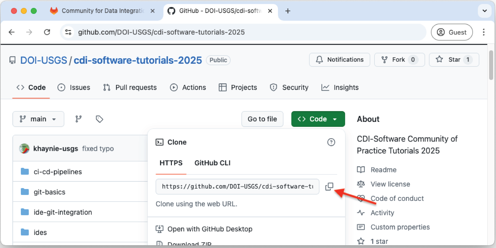

# Exercise 1: Clone repository and set up user

TODO

1. Change into a suitable directory, e.g. `$HOME/Git`
2. git clone
   1. `git clone https://code.usgs.gov/cdi/cdi-software/tutorials-2025.git`
3. git config username
4. .gitignore
5. git init
6. git remote -v (demo)
    1. managing remotes <- should we have them rename origin to upstream? (this sets up tracking to upstream...)
    2. `git remote rename origin upstream`

------

## Navigation

- [**Tutorial Index**](../README.md#tutorial-outline)
- Previous --> [Git reference commands](./pages/git-help-and-cofig.md)
- Next --> [Exercise 2](./ex2-local-branch.md)

------
