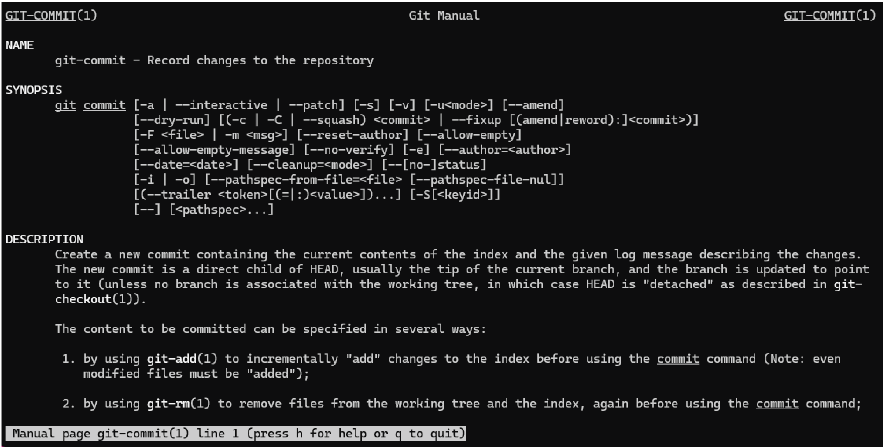

# Git Help and Configuration

Once you have Git installed, there are a plethora of commands to explore! If this is the first time installing git on your computer, you will need to configure your credentials before you can start using these commands.

## Git commands and options

Use the `help` command to display the most commonly used Git commands:

- `git help`

Append `--all` to display all the avaiable Git commands and `--guides` to provide a list of Git concept guides and tutorials.

To learn more about a specific command or guide, append the name of the command/guide to `help`:

- `git help COMMAND`

For example, if you want to learn more about the `commit` commands, use

- `git help commit`

This will provide details from the Git Manual on how to use the `commit` command (see figure below).

Alternatively, if you want to have help infromation displayed on your terminal instead of opening the Git Manual, use

- `git COMMAND -h`

More information on the `help` command is avaialble at https://git-scm.com/docs/git-help.

## Git configuration

When using Git for the first time, you need to configure your name and e-mail address. Git uses this information in order to keep track of your changes. These configurations can be set at various levels: local, global, or system. In this tutorial, we will use the global level. More details on these levels, as well as other config options, are available through the Git manual (`git help config`).

First, let's check if you previously created a global Git config:

- `git config --list --global`

If this command prints out your name and e-mail address, then you are all set! Else, use the following commands to set your name and e-mail address:

- `git config --global user.name "YourNameHere"`
- `git config --global user.email "YourEmailHere"`

If you are using Government Furnished Equipment, we recomend using your government e-mail address. Run `git config --list --global` again to verify your credentials were set correctly.

Git config can be used to set other configurations! In this tutorial, however, setting your name and e-mail address is enough. For information on how to setting other configurations, such as your preferred editor, check out https://cdi.code-pages.usgs.gov/usgs-git-and-software-release-course/setup-git.html.

---

## Navigation

- [**Tutorial Index**](../README.md#tutorial-outline)
- Previous --> [What is Git](./pages/what-is-git.md)
- Next --> [Exercise 1](./ex1-clone-and-setup.md)

---
