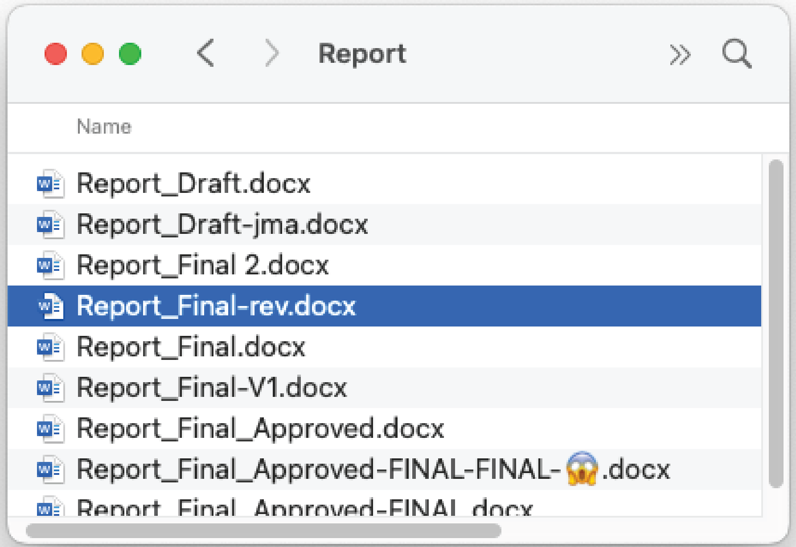

# What is Git (and why should I care)?

[//]: # TODO: This draws from https://code.usgs.gov/cdi/usgs-git-and-software-release-course/-/blob/main/instructors/instructor-notes.md

<!---
Material drawn from:
- https://code.usgs.gov/cdi/usgs-git-and-software-release-course/-/blob/main/instructors/instructor-notes.md
- https://code.usgs.gov/cdi/usgs-git-and-software-release-course/-/blob/main/learners/setup.md
---->

Whether you work alone or with a team, you've almost certainly wanted to keep track of different
versions of your work, be it a document, dataset, or software code. Examples of version control
include the undo command in your editor, keeping multiple copies of a Word document, track changes,
and file version history in OneDrive.

Git is a Version Control System (VCS) that keeps track of what was done, when, and by whom by
storing file *changes*, or *diffs*, to record *snapshots* of our files. Though it is most commonly
used for source code projects, git can also be useful for many other applications. For example, the
[GHSC FSP documentation](https://ghsc.code-pages.chs.usgs.gov/fsp/guidelines/index.html) is
developed with git.

- Git: open source software version control system
- GitLab and GitHub: platforms that host Git repositories for web-based collaboration and provide
  additional tools.

Main concepts:

- *commit*: a set of changes in the projects files
- *repository*: the history of commits in the project

Every copy of a git repository is a backup of the project and it's history, and it takes a bit of
work to delete part of that history.

TODO: expand on key concepts of git, add a glossary of common git terms
- Remote vs. local repositories
- Origin, upstream
- branch and fork

------

## Navigation

- [**Tutorial Index**](../README.md#tutorial-outline)
- Previous --> [Prerequisites](../README#pre-tutorial-instructions)
- Next --> [Try it out](TODO)

------
