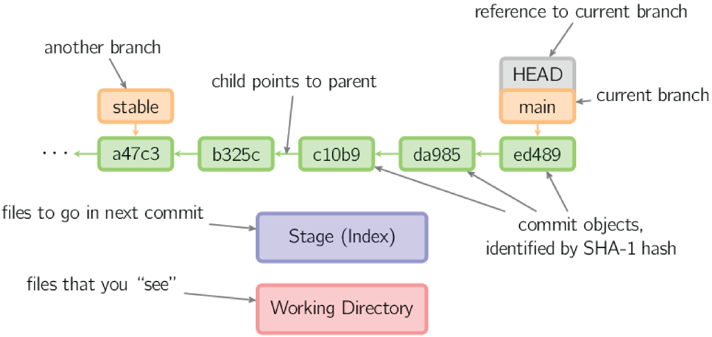

# What is Git (and why should I care)?

TODO: This draws from https://code.usgs.gov/cdi/usgs-git-and-software-release-course/-/blob/main/instructors/instructor-notes.md and https://blog.ltgt.net/teaching-git/

<!---
Material drawn from:
- https://code.usgs.gov/cdi/usgs-git-and-software-release-course/-/blob/main/instructors/instructor-notes.md
- https://code.usgs.gov/cdi/usgs-git-and-software-release-course/-/blob/main/learners/setup.md
---->

Whether working alone or with a team, you've almost certainly wanted to keep track of different
versions of your work, be it a document, dataset, or software code. Examples of version control
include the undo command in your editor, keeping multiple copies of a Word document, track changes,
and file version history in OneDrive. These methods of version control have significant limitations.

## What is Git?

Git is a Version Control System (VCS) that keeps track of what was done, when, and by whom, by
efficiently storing snapshots of our files. Though it is most commonly used for source code
projects, git can also be useful for many other applications. For example, the
[GHSC Fundamental Science Practices Guidance documentation](https://ghsc.code-pages.chs.usgs.gov/fsp/guidelines/index.html)
is developed using git.

TODO: FSP documentation is CHS page (internal USGS only?) - do we need a different example?

Git vs. GitHub and GitLab

### Git vs. GitHub and GitLab

- Git: open source software version control system
- GitLab and GitHub: platforms that host Git repositories for web-based collaboration and provide
  additional tools

## Main concepts

Git stores snapshots of our files, though for efficiency, it actually stores changes, or "diffs".
A git *repository* contains the history of commits and each copy of a git repository is a backup of
of the project and it's history.

### *Commit*

A set of changes in the project files containing:

- one or more parent commits, or none for the very first commit
- a commit message
- author
- timestamp
- list of files and their content

What are those git identifiers?

### Git SHA1 Hashes

Each object (file, commit, etc.) is identified by the SHA1 hash of the objects contents. Git allows
us to work with a unique prefix of the full SHA1 hash, or the first six or eight characters of the
40-digit hexadecimal number.

### References, branches, and tags

SHA1 hashes are difficult to work with, so git allows us to work with *references* to specific
*commits* using names we choose to use as labels. The two main types of references are *branches* and *tags*.
Another special reference is *HEAD*, which points to the *current commit* (the commit that is
checked out in your working directory).

#### *Branches*

*Branches* are references that can be moved (i.e. mutable). Branches can be used to organize your
work on different parts of a project. For example, you may develop a specific software feature on
a branch called `plot-data`. There may be a number of commits needed to develop this feature, and
the branch reference, `plot-data`, will point to the most recent commit on the branch.

Branches can be given arbitrary names, but there are common branches called `main` or `master`,
which are generally the primary branch in a repository.

#### *Tags*

- *tags*: immutable references (they can be changed, but this is generally ill advised)

A simple example of a tag is a released version of software, e.g. tag `1.0` should always point to
the same commit. Bugfixes may be released as new tags, e.g. `1.1`, built from the `1.0` tag, and a
subsequent version of the software may be tagged as `2.0`.

### The three "areas"

When working in a git repository, the files you see and manipulate are in your *working directory*.
To create commits, you *stage* files in the *index* or *staging area* (`git add ...`). Once the
content of a commit is ready, you add a commit message and move the *staged* changes to the git
*history* (green in the figure below, `git commit -m`). The *working directory* is initialized from
a specific commit in the *history* (`git checkout ...`). The history consists of individual commit
objects and references (orange and gray in the figure below) point to specific commits.

|     |
|:---:|
||
|*Commits, references, and areas (source: [A Visual Git Reference](https://marklodato.github.io/visual-git-guide/index-en.html#conventions), Mark Lodato*)|

TODO: add a [glossary](./glossary.md) of common git terms

- Remote vs. local repositories
- Origin, upstream
- branch and fork

------

## Navigation

- [**Tutorial Index**](../README.md#tutorial-outline)
- Previous --> [Prerequisites](../README#pre-tutorial-instructions)
- Next --> [Git reference commands](./pages/git-help-and-config.md)

------
