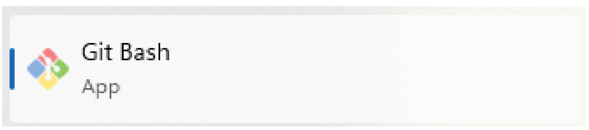

# Git Basics Tutorial Prerequisites

# Contents

- [Git Installation](#git-installation)
  - [Windows](#windows)
    - [For Federal Employees](#for-federal-employees)
    - [For External Collaborators](#for-external-collaborators)
  - [Mac](#mac)
    - [For Federal Employees](#for-federal-employees-1)
    - [For External Collaborators](#for-external-collaborators-1)
  - [Linux/Unix](#linuxunix)
    - [For Federal Employees](#for-federal-employees-2)
    - [For External Collaborators](#for-external-collaborators-2)
- [Resources](#resources)

# Git Installation

## Windows

Since this presentation will do its best to be platform agnostic, all commands in the demonstration will be run in a bash terminal. As a result, it is recommended that Windows users follow along in a Git Bash terminal. The Directions below outline how to install this application.

> Before trying to install Git Bash, check if it has already been installed. In the Windows search bar type `git bash`. If the below logo appears, click on it, and validate that a terminal window opens.

### For Federal Employees

Contact your local IT and have them install [Git Bash (Git for Windows)][1] through your organizations software center or manually. Provide details of the configurations outlined in the [For External Collaborators section](#for-external-collaborators) below.

### For External Collaborators

1. Navigate to the [Git Bash (Git for Windows)][1].
2. Download the latest version available.
3. Click on the downloaded executable. Will look something like `Git-<version>-64-bit.exe`.
4. On the "Select Components" window ensure that the "Windows Explorere Integration" -> "Open Git Bash here" box is checked.
5. Click "Next".
6. On the "Choosing the default editor used by Git" window select your preferred editor from the drop down (e.g. Vim, Notepad++, VSCode). Git will use this to allow you to edit messages describing code changes, update configurations, etc.
7. Click "Next".
8. On the "Adjusting the name of the initial branch in new repositories" window select the "Override the default branch name for new repositories". Set the default branch name to `main`. This is the default name used by both GitHub and GitLab.
9. Click "Next".
10. On the "Adjusting your PATH environment" window, decide whether you want git integrated into Windows Powershell and other third party software (e.g. editors like VSCode that have git integrations) or not. If yes, select the "Git from the command line and also from 3rd-party software". If no, select "Use Git from Git Bash only" (you will only be able to use git commands in a Git Bash terminal).
11. Click "Next".
12. On the "Choosing the SSH executable" window, specify where git should look for ssh executables.
13. Click "Next".
14. On the "HTTPS transport backend" window, specify where git will use certificates to validate https requests.
15. Click "Next".
16. On the "Configuring the line ending conversions" window, select "Checkout Windows-style, commit Unix-stile line endings".
17. Click "Next".
18. On the "Configuring the terminal emulator to use with Git Bash" window, examine how each option will effect your ability to use other Windows programs and pick which window is best for your use case.
19. Click "Next".
20. On the "Choose the default behavior of \`git pull\`" window, it is recommended that you use "Only ever fast-forward". This is the equivalent of the command `git pull --ff-only`. This will be explained more in the tutorial.
21. Click "Next".
22. On the "Choose a credential helper" window, ensure the "Git Credential Manager" is selected.
23. Click "Next".
24. On the "Configure extra options" window, select any aditional configurations you would like.
25. Click "Next".
26. Click "Install".

## Mac

Bash is available on all recent versions of Mac OS X (shipped with Xcode), though Zsh may be the default shell. To make
sure you are using Bash, open a terminal (`/Applications/Utilities/Terminal.app`) or an IDE with an
integrated terminal (e.g. VSCode), and type `echo $SHELL` and hit `Return`. If the result does not
end with `/bash`, you can change your shell to Bash by typing `bash` and then `Return`. Running
`echo $0` will confirm that your current shell is Bash.
Git is usually available by default on MacOS. To confirm this, in the terminal, run `git --version`.
This will print the version of Git on your system or report an error if Git is an unknown command. If you are on Mac version 10.9 or greater, you may automatically get a pop up window to install Git.

### For Federal Employees

Contact your local IT and have them install [Git for macOS][2].

### For External Collaborators

Option 1: Install the Xcode Command Line Tools

> If you are doing software development work, you will likely need this anyway

1. Open your Mac App Store
2. Search for Xcode
3. Install and follow configuration prompts

Option 2: Use Homebrew

1. Open a terminal Window
2. Run the command `brew install git`

## Linux/Unix

To check if git is already installed, in the terminal, run `git --version`.
This will print the version of Git on your system or report an error if Git is an unknown command.

### For Federal Employees

Commands to install git will require sudo privilages. Contact your local IT and have them install [Git for Linux/Unix][3].

### For External Collaborators

1. Determine what operating system your machine is.
2. Find the corresponding name on the Git [Download for Linux and Unix page][3]
3. Follow the instructions to install
4. Open a new terminal window and run `git --version` to confirm it is installed

## Resources

- [CDI Software Release Course Setup Documentation][4]
- [Git Install Documentation][5]
- [W3 Schools Git Tutorial][6]

[1]: https://git-scm.com/downloads/win "This is a non-Federal link"
[2]: https://git-scm.com/downloads/mac "This is a non-Federal link"
[3]: https://git-scm.com/downloads/linux "This is a non-Federal link"
[4]: https://code.usgs.gov/cdi/usgs-git-and-software-release-course/-/blob/main/learners/setup.md "This is a non-Federal link"
[5]: https://git-scm.com/book/en/v2/Getting-Started-Installing-Git "This is a non-Federal link"
[6]: https://www.w3schools.com/git/git_install.asp?remote=github "This is a non-Federal link"

---

## Navigation

- [**Tutorial Index**](./README.md#tutorial-outline)
- Next --> [What is Git?](./what-is-git.md)

---
