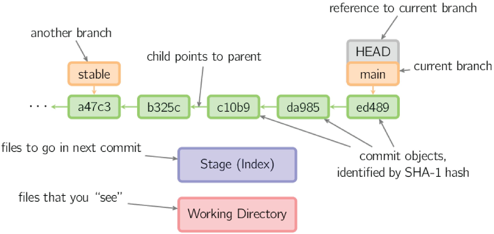
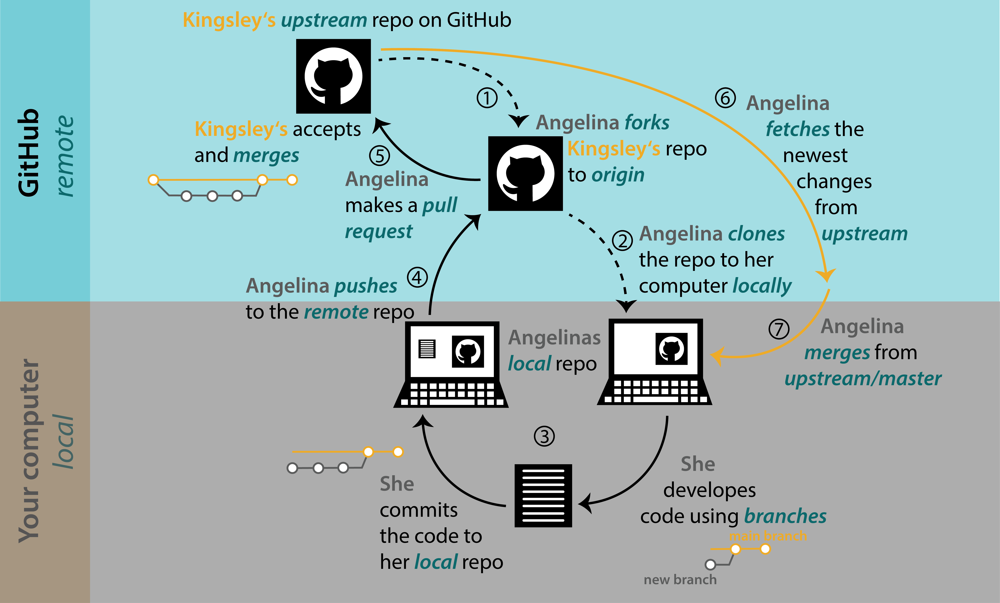

# What is Git (and Why Should I Care)?

Whether working alone or with a team, you've almost certainly wanted to keep track of different
versions of your work, be it a document, dataset, or software code. Examples of version control
include the undo command in your editor, keeping multiple copies of a Word document, track changes,
and file version history in OneDrive. These methods of version control have significant limitations.

## What is Git?

Git is a Version Control System (VCS) that keeps track of what was done, when, and by whom, by
efficiently storing snapshots of our files. Once you commit a snapshot of your changes into Git, it
is difficult to lose those changes, especially if you are pushing your repository to a remote
server (e.g. GitLab or GitHub). This gives you freedom to experiment because Git allows you to
revert back to a previous state.

 [xkcd.com/1597][xkcd-1597]

[xkcd-1597]: https://xkcd.com/1597 "This is a non-Federal link"

Though Git is most commonly used for source code projects, it can also be useful for other
applications. For example, some coding projects publish documentation and user guides via Git pages
(ShakeMap code repository: <https://code.usgs.gov/ghsc/esi/shakemap> and associated Git pages site:
<https://ghsc.code-pages.usgs.gov/esi/shakemap/>). Of course, a repository could contain
documentation without any code or static data files.

For the purposes of this tutorial, we'll generally be talking about developing software, whether
this is a software package or scripts to process and visualize data.

---

*

Git vs. GitHub and GitLab
*

> ### Git vs. GitHub and GitLab
>
> - __*Git*__: open source software version control system
> - __*GitLab*__ and __*GitHub*__: platforms that host Git repositories for web-based collaboration and provide
>   additional tools

---

## Main concepts

Git stores snapshots of our files, though for efficiency, it actually stores changes, or "diffs".
A Git *repository* contains the history of commits and each copy of a Git repository is a backup of
the project and it's history.

### *Commit*

A set of changes in the project files containing:

- one or more parent commits, or none for the very first commit
- a commit message
- author
- timestamp
- list of files and their content

---

*

What are those Git identifiers?
*

> ### Git SHA1 Hashes
>
> Each object (file, commit, etc.) is identified by the SHA1 hash of the objects contents. Git allows
> us to work with a unique prefix of the full SHA1 hash, or the first six or eight characters of the
> 40-digit hexadecimal number.
>
> Note that Git will eventually use the stronger SHA-256 hash function.

---

### References, branches, and tags

SHA1 hashes are difficult to work with, so Git allows us to work with *references* to specific
*commits* using names we choose to use as labels. The two main types of references are *branches* and *tags*.
Another special reference is *HEAD*, which points to the *current commit* (the commit that is
checked out in your working directory).

#### *Branches*

*Branches* are references that can be moved (i.e. mutable). Branches can be used to organize your
work on different parts of a project. For example, you may develop a specific software feature on
a branch called `plot-data`. There may be a number of commits needed to develop this feature, and
the branch reference, `plot-data`, will point to the most recent *commit* on the branch.

Branches can be given arbitrary names, but there are common branches called `main` or `master`,
which are generally the primary branch in a repository.

Branches can be used to organize your work and isolate development from stable code. For example,
if you need to parse a new input file format, it's a good idea to do this on a branch so that
you don't break the stable code on `main`. Once the new feature works, the development branch is
*merged* back into the `main` branch and the development branch can be deleted (it's just a
reference to a series of commits, so nothing is lost).

#### *Tags*

*Tags* are immutable references to a specific *commit*. A simple example of a tag is a released
version of software, e.g. tag `1.0` should always point to the same commit. Bugfixes may be
released as new tags, e.g. `1.1`, built from the `1.0` tag, and a subsequent version of the
software may be tagged as `2.0`.

Note that it *is* possible to change a *tag*, but this is generally ill advised, especially once it
has been pushed to a remote server (just make a new one! `1.1.1`).

*

Maybe I'll just reuse this tag...
*

### Git "areas" and "states"

When working in a Git repository, the files you see and manipulate are in your *working directory*.
To create commits, you *stage* files in the *index*, also called the *staging area*,
(`git add ...`). Once the content of a commit is ready, you add a commit message and move the
*staged* changes to the Git *history* (green in the figure below, `git commit -m`). The *working
directory* is initialized from a specific commit in the *history* (`git checkout ...`). The history
consists of individual commit objects and references (orange and gray in the figure below) point to
specific commits.

Along these lines, files in your working directory can be in a number of states:

- *modified*: files that have been, well, modified
- *staged*: files have been moved to the *index*, or *staging area*
- *committed*: once you create a commit, which pushes *staged* files into the Git *history*
  - unmodified files are also in the *committed* state
- *untracked*: any files in your working directory that have not been added to your Git repository

|     |
|:---:|
|  |
| *Commits, references, and areas (source: [A Visual Git Reference][visual-git-ref], Mark Lodato)* |

[visual-git-ref]: https://marklodato.github.io/visual-git-guide/index-en.html#conventions "This is a non-Federal link"

### Some other Git terms

These will be covered in more detail later but are mentioned here in case the terms come up.

#### Remote vs. local repositories

A *local* Git repositories are directories with a `.git` folder at the root of the repository on
your machine. A local Git repository may or may not be a *clone* of a *remote* repository, which
is hosted remotely on GitHub or GitLab, for example. A *local* repository can be syncronized with
one or more *remote* repositories using *pulls* and *pushes*, which will be covered in more detail
later.

#### Brances and Forks, Origin and Upstream

There are many ways to collaborate using Git, one of which is a *forking* workflow, in which each
collaborator creates a *fork*, or copy, of the main repository. The main repository is referred to
as the *upstream* repository and a user's own *fork* is referred to as the *origin* repository.
Typically a user will push a *branch* to their own *fork*, the remote *origin* repository, and
then, once work on the branch is complete, incorporate their work into the main *upstream*
repository by way of a *merge request* (GitLab) or *pull request* (GitHub).

> [!NOTE]
> The request to incorporate changes from a repository *fork* into the main repository has a
> different name on *GitLab* and *GitHub*, even though the end result is the same:
>
> - *GitLab* calls this a __*merge request*__
> - *GitHub* calls this a __*pull request*__

|     |
|:---:|
||
|*Forking workflow (source: [Version Control with Git and GitHub](https://biostats-r.github.io/biostats/github/Pics/fork_branch_tutorial/1_workflow3.png), A. Halbritter and R.J. Telford, BioStats*)|

## References

Chacon, S. and Straub, B., Pro Git, version 2, <https://git-scm.com/book/en/v2>.

Haider, S.M., Langseth, M.L., Ross, J.C., Martinez, E.M., and Sherwood C.R., 2025, USGS Git and
Software Release Course, version 1.0.0: U.S. Geological Survey software release,
<https://cdi.code-pages.usgs.gov/usgs-git-and-software-release-course/index.html>.

---

## Navigation

- [**Tutorial Index**](./README.md#tutorial-outline)
- Previous --> [Prerequisites](./prereq.md)
- Next --> [Git reference commands](./git-help-and-config.md)

---
