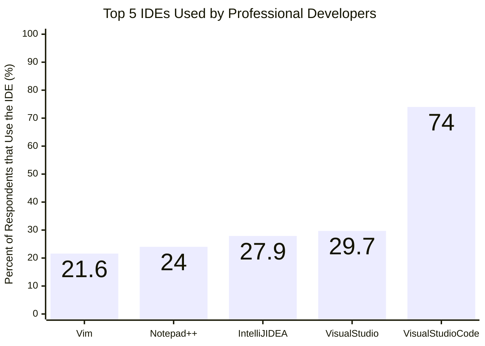

# Popular IDEs

## Contents
- [Popular IDEs](#popular-ides)
  - [Contents](#contents)
  - [Overview](#overview)
  - [Vim](#vim)
  - [Notepad++](#notepad)
  - [IntelliJ IDEA](#intellij-idea)
  - [Visual Studio](#visual-studio)
  - [Visual Studio Code (VSCode)](#visual-studio-code-vscode)

## Overview
There are many IDEs available, both for free and with a license. Some IDEs are language specific (e.g. RStudio, Spyder), while others are language agnostic and provide language support through plugins (e.g. VSCode, Notepad++). While there are hundreds of options, this document will focus on the top 5 most popular IDEs, with professional developers, reported by the [Stack Overflow 2024 Developer Survey][1].

*Figure 1*: Percentage of surveyed professional developers that reported using the specific IDE adapted from [Stack Overflow 2024 Developer Survey's technology question results][1]. Respondants could select multiple IDEs.

## Vim
21.6% of surveyed developers reported using Vim. [VI IMproved (Vim)][2] is a text editor commonly distributed with Unix systems. While its configurable functionality is largely constrained to text editing, its popularity and ease of use in the terminal have made many consider it an IDE. Vim is not a point and click graphical user interface (GUI) and all commands must be performed [via keystrokes][3]. 

| Pros | Cons |
| -------- | ------- |
| Commands are performed with keystrokes which is generally faster than point and click  | The learning curve for understanding commands can be steep |
| Pre-installed on most unix systems | No integrated debugging |
| Highly configurable | Linters and debuggers are more difficult to integrate into an editing workflow |
| Configurations are portable | |
| Free | |

> Pros and cons are subject to opinion. Ultimately the best IDE is the whatever makes you most efficient.

  
Basic Commands

| Command | Action |
| -------- | ------- |
| `vim <path to file>`  | Opens a file |
|`i` | Enters insert (edit) mode |
|`a` | Enters insert (edit) mode and append to the current line |
| `dd` | Deletes current line |
| `dw` | Deletes word at cursor position |
| `yy` | Copies current line |
| `p` | Pastes after the cursor |
| ESC | Return to command mode |
| `:wq` | Writes (saves) and quits (closes) the file |
| `:q!` | Quits (closes) the file without saving |
| `:help` | Open the Vim manual |
| `0` | Cursor jumps to the beginning of the current line |
| `$` | Cursor jumps to the end of the current line |
| CTRL + `b` | Cursor jumps to the beginning of the file |
| CTRL + `f` | Cursor jumps to the end of the file |
| `:<line number>`| Cursor jumps to the specified line number (e.g. `:21`) |
| `w`| Cursor jumps to the beginning of the next word |
| `e`| Cursor jumps to beginning of the current word |
| `b`| Cursor jumps to end of the current word |

Things to consider when executing commands
- Prefix commands with ESC if you are currently in a mode (e.g. insert mode) and want to go back to command mode
- During editing, Vim creates a copy of the file that generally looks like `.<filename>.swp`. For example, if I was editing `text.txt`, the file might look like `.text.txt.swp`. These files provides data recovery. If a file is not closed correctly (using the write or quit commands), then upon opening the file in Vim again, you will be provided with a message like `Found a swap file by the name ".text.txt.swp"`. You will have the option to recover the data, delete the .swp file, edit the file anyway, open readonly, quit, or abort (options are always listed at the bottom of the message).

## Notepad++
24% of surveyed developers reported using Notepad++. [Notepad++][4] is a simple GUI that implements a [point and click text editor][5]. Notepad++ provides tab editing so that multiple files may be opened and edited at once. Syntax highlighting is another key feature of this IDE.

| Pros | Cons |
| -------- | ------- |
| GUI provides intuitive buttons for commands  | Not designed for operating systems other than Windows |
| Multi-document view with tabs | Linters and debuggers are more difficult to integrate into an editing workflow |
| Lightweight installation |  |
| Configurations are portable | |
| Free | |

> Pros and cons are subject to opinion. Ultimately the best IDE is the whatever makes you most efficient.

## IntelliJ IDEA
27.9% of surveyed developers reported using [IntelliJ IDEA (JetBrains)][6]. This IDE is designed specifically for [Java][7] and [Kotlin][8] development. It provides a graphical user interface, auto-formatting, debugging, and access to an integrated extension marketplace.

| Pros | Cons |
| -------- | ------- |
| GUI provides intuitive buttons for commands  | Language specific (although plugins may be available for some languages) |
| Robust debugging environment | Requires license purchase |
| Fast | |
| Git integration | |
| Extension/Plugin marketplace | |

> Pros and cons are subject to opinion. Ultimately the best IDE is the whatever makes you most efficient.

## Visual Studio
29.7% of surveyed developers reported using [Visual Studio][9]. This robust IDE has all the features one would need for .NET and C++ development. It also provides extensive support for other languages (e.g. Python). It provides very similar features as IntelliJ IDEA and VSCode. While it too has an extension marketplace, a wide array of features come preinstalled. 

| Pros | Cons |
| -------- | ------- |
| GUI provides intuitive buttons for commands  | Large download size |
| Powerful engine support | Only community edition is free (some features locked behind license paywall) |
| Robust debugging environment | Designed for MacOS and Windows only |
| Git integration | |
| Extension/Plugin marketplace | |

> Pros and cons are subject to opinion. Ultimately the best IDE is the whatever makes you most efficient.

## Visual Studio Code (VSCode)
74% of surveyed developers reported using [Visual Studio Code (VSCode)][10]. VSCode has the option of many (if not all) of the features of provided by  IntelliJ IDEA and Visual Studio, packaged as a lightweight, configurable IDE installation. The base installation of this IDE has builtin Javascript, Typescript, and NodeJS support. Debugging and linting for other languages is provided via VSCode's large extension marketplace.

| Pros | Cons |
| -------- | ------- |
| GUI provides intuitive buttons for commands  | Support for code languages through extensions/plugins |
| Lightweight installation  | Some performance degradation reported for large, complex code libraries |
| Portable configuration | Can be run on Windows, MacOS, and Linux  |
| Extension/Plugin marketplace | |
| Free | |

> Pros and cons are subject to opinion. Ultimately the best IDE is the whatever makes you most efficient.

[1]: https://survey.stackoverflow.co/2024/ "This is a non-Federal link"
[2]: https://www.vim.org/ "This is a non-Federal link"
[3]: https://vimhelp.org/usr_toc.txt.html#_getting-started "This is a non-Federal link"
[4]: https://notepad-plus-plus.org/ "This is a non-Federal link"
[5]: https://npp-user-manual.org/ "This is a non-Federal link"
[6]: https://www.jetbrains.com/idea/ "This is a non-Federal link"
[7]: https://dev.java/learn/getting-started/ "This is a non-Federal link"
[8]: https://kotlinlang.org/docs/getting-started.html# "This is a non-Federal link"
[9]: https://visualstudio.microsoft.com/ "This is a non-Federal link"
[10]: https://code.visualstudio.com/ "This is a non-Federal link"