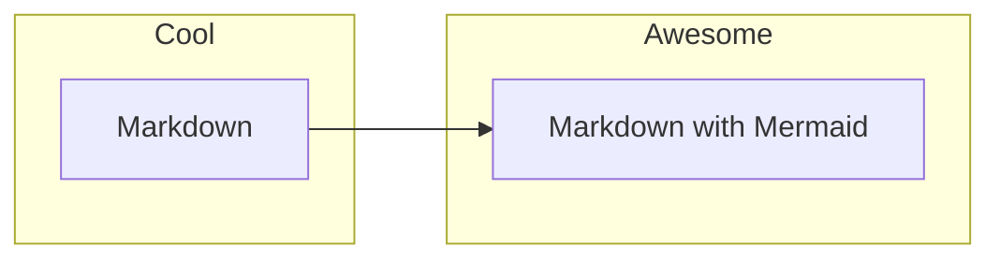
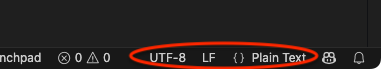
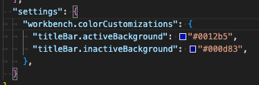

# IDE Tips and Tricks

IDEs come with many built-in conveninences out of the box and settings can be customized. A quick
google search will find cheat sheets for your preferred IDE, for example:

- VSCode keyboard shortcuts for [Mac][vscode-mac-shortcuts] and [Windows][vscode-pc-shortcuts]
- RStudio keyboard shortcuts for [Mac and PC][rstudio-shortcuts]

The tips and tricks below are focused on VSCode, but some keyboard shortcuts for RStudio are also
provided.

- [IDE Tips and Tricks](#ide-tips-and-tricks)
  - [Some of our favorite tips and tricks](#some-of-our-favorite-tips-and-tricks)
    - [Column select mode](#column-select-mode)
    - [Go To](#go-to)
    - [Navigate through code](#navigate-through-code)
    - [VSCode Command Palette](#vscode-command-palette)
    - [Switch focus](#switch-focus)
    - [Markdown preview](#markdown-preview)
    - [Change line endings, encoding, and more](#change-line-endings-encoding-and-more)
    - [Workspaces and workspace-specific customization](#workspaces-and-workspace-specific-customization)
    - [VSCode Snippets](#vscode-snippets)
    - [Auto doc-strings](#auto-doc-strings)

## Some of our favorite tips and tricks

<details><summary>Column select mode</summary>

### Column select mode

Select a block of text, or position the cursor, across multiple lines to edit in multiple places at
once or copy columns of data.

- VSCode: hold Shift + Option (Mac) or Shift + Alt (PC/Linux) and click/drag with the mouse
- RStudio: Option (Mac) or Alt (PC/Linux) and click/drag with mouse


</details><br>

<details><summary>Go To...</summary>

### Go To

Navigate to a specific line/column number:

- VSCode: Ctrl+G
- RStudio: Option+Shift+Cmd+G (Mac) or Alt+Shift+G (PC/Linux)

Navigate to the last cursor location (across documents):

- VSCode: Ctrl+- (Mac) or Ctrl+Alt+- (PC/Linux), hold shift to navigate forward
- RStudio: Cmd+F9 and Cmd+F10 (Mac) or Ctrl+F9 and Ctrl+F10 (PC/Linux)

There are a lot of other things you can go to (matching bracket, definitions, last location), check
cheat sheets and the GUI (see "Go" in the menu bar) to see what's possible.

</details><br>

<details><summary>Navigate through code</summary>

### Navigate through code

Need to checkout a function defined in another file in your code base? Or even a function in a
Python module installed in your project's virtual environment? Cmd+click (Mac) or Ctrl+click
(PC/Linux) the function name to navigate to the definition. (Then navigate back with keyboard
shortcuts defined in the section above!)

</details><br>

<details><summary>VSCode Command Palette</summary>

### VSCode Command Palette

The Command Palette provides access to all of VSCodes functionality, settings, and extensions.
Access by typing Cmd+Shift+P (Mac) or Ctrl+Shift+P (PC/Linux) and checkout the
[Command Pallet section](vscode.md#5-command-palette) in the VSCode overview.

</details><br>

<details><summary>Switch focus</summary>

### Switch focus

Switch from the editor to the terminal to the explorer and back, without leaving the keyboard.

- VSCode (customize any of these!):
  - Ctrl+` to cycle between terminal and editor (and hide the terminal)
  - Ctrl+0 to move to the navigator/explorer
  - Ctrl+number focuses on the first, second, third, etc. document in the editor pane

</details><br>

<details><summary>Markdown preview</summary>

### Markdown preview

Preview the rendered Markdown with clean tables, lists, links, and images.

- VSCode: Cmd+Shift+V (Mac) or Ctrl+Shift+V (PC/Linux)

Bonus! See rendered [Mermaid diagrams][mermaid-info] (with a Mermaid extension for markdown), also
see [Extensions for Document Preview](vscode-settings-extensions.md#extensions-for-document-preview).
For example:



</details><br>

<details><summary>Change line endings, encoding, and more</summary>

### Change line endings, encoding, and more

Ever struggle with line endings when sharing files between users on different systems? Of course,
this can be standardized with Git hooks and editor settings, but you can make quick changes right
from the VSCode status bar (as well as the encoding or language/file type).



</details><br>

<details><summary>Workspaces and workspace-specific customization</summary>

### Workspaces and workspace-specific customization

VSCode workspaces are collections of one or more folders that are opened in a VSCode window
(instance). They provide a convenient way to switch between tasks or projects. If you close and
reopen a workspace the open editors persist so you can pick up where you left off.

For those of us who may have a few too many windows open at once, you can customize the appearance
of VSCode on a workspace-specific basis. For example, you can set a custom title bar color for each
workspace. Open the Command Palette with Cmd+Shift+P (Mac) or Ctrl+Shift+P (PC/Linux) and start
typing "workspace settings" to open the workspacing settings JSON file. Add the following to the
`settings.json` file (create a `"settings"` object, if there is a `workspace.json` file):

```json
{
  "workbench.colorCustomizations": {
    "titleBar.activeBackground": "#0012b5",
    "titleBar.inactiveBackground": "#000d83",
  }
}
```

Or, in a `workspace.json` file:



</details><br>

<details><summary>VSCode Snippets</summary>

### VSCode Snippets

VSCode snippets are templates to insert commonly used code patterns (for example, one of these
expanding-details markdown blocks or conditional statements and loops). There are built in snippets
and users can create their own custom snippets. Access through the Command Palette with Cmd+Shift+P
(Mac) or Ctrl+Shift+P (PC/Linux) and start typing "snippets". "Configure Snippets" to create a new
global snippets file or edit existing user snippets.

</details><br>

<details><summary>Auto doc-strings</summary>

### Auto doc-strings

Code documentation is important, but does anyone like to do it? VSCode can make it a little easier
with automatic doc-strings. VSCode provides this out-of-the box for typescript and language-specific
extensions can create configurable auto doc-strings for other languages like Python, below:


</details><br>

[mermaid-info]: https://mermaid.js.org/intro/ "Not a Federal Link"
[rstudio-shortcuts]: https://posit.co/wp-content/uploads/2022/10/rstudio-ide-1.pdf "Not a Federal Link"
[vscode-mac-shortcuts]: https://code.visualstudio.com/shortcuts/keyboard-shortcuts-macos.pdf "Not a Federal Link"
[vscode-pc-shortcuts]: https://code.visualstudio.com/shortcuts/keyboard-shortcuts-windows.pdf "Not a Federal Link"