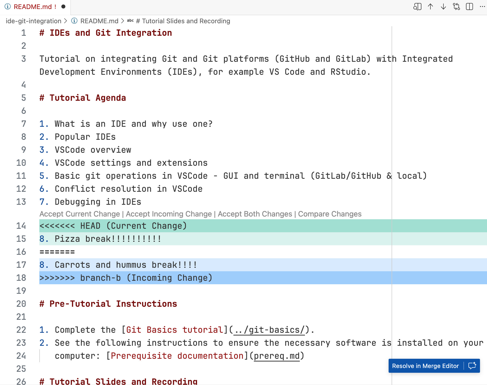
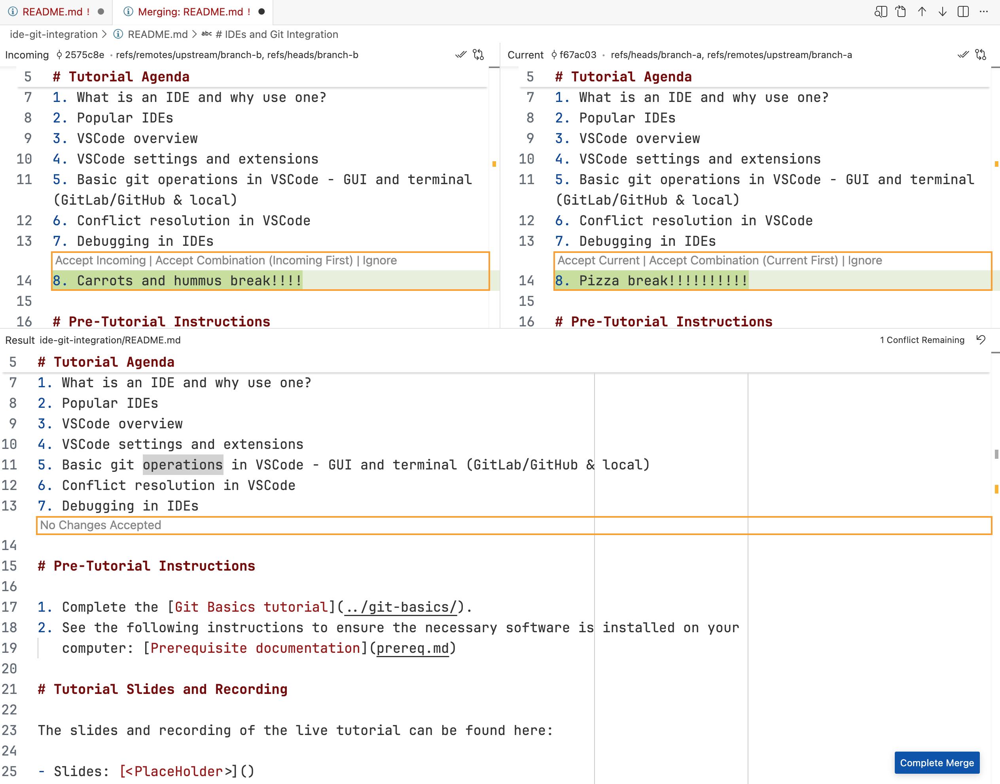

# Merge conflict management in VS Code

Merge conflicts are a fact of life when working with Git and collaborating with others.
While never fun to resolve, VS Code makes this process more intuitive with its graphical
interface. This guide will walk through an example merge conflict and show screenshots
of how to resolve it using VS Code.

## Example scenario

Consider two branches, `branch-a` and `branch-b`, both created from `main`. You are
working on `branch-a` and your colleague is working on `branch-b`. It becomes necessary
to merge `branch-b` into `branch-a` to incorporate your colleague's changes. BUT: When
you run
```
git merge branch-b
```
from the `branch-a` branch, you get the dreaded message:
```
CONFLICT (content): Merge conflict in ide-git-integration/README.md
Automatic merge failed; fix conflicts and then commit the result.
```
Evidently, your colleague and you both modified the file `ide-git-integration/README.md`
causing a conflict when you tried to merge in `branch-b` into `branch-a`.

## The resolution

Running `git status` will show you a list of the files that were "both modified", here:
```
On branch branch-a
You have unmerged paths.
  (fix conflicts and run "git commit")
  (use "git merge --abort" to abort the merge)

Unmerged paths:
  (use "git add <file>..." to mark resolution)
	both modified:   ide-git-integration/README.md

no changes added to commit (use "git add" and/or "git commit -a")
```

**If you view the offending file in the terminal** (via e.g.
`cat ide-git-integration/README.md`) you'll see the [possibly familiar] `<<<<<<<`,
`=======`, and `>>>>>>>` indicators showing where in the file conflicts exist. A valid
way to move forward is to manually edit the file, removing the indicators and adjusting
the line content until you're satisfied with the conflict resolution. However, VS Code
makes this easier...

**If you view the offending file in VS Code**, you're presented with the following
content shown in the screenshot below.



This is the same file you'd see in the terminal, but VS Code provides buttons above each
conflicting section to help you resolve the conflict. You can "Accept Current Change" or
similar options to quickly resolve the conflict without manually editing the file text.

For more complicated merge conflicts, you can click the blue "Resolve in Merge Editor"
button at the bottom-right corner of the screen to launch the Merge Editor, which shows
three versions of the file: Incoming, current, and merged result.



Here you can make finer-grained adjustments more easily. When you're done, click
"Complete Merge" and you'll be prompted for a commit message.

## Try it out yourself!

You can re-create the above scenario locally by cloning this repository, switching to
[`branch-a`](https://code.usgs.gov/cdi/cdi-software/tutorials-2025/-/tree/branch-a), and
merging in
[`branch-b`](https://code.usgs.gov/cdi/cdi-software/tutorials-2025/-/tree/branch-b) to
see how VS Code helps you resolve the conflicts. This is a great way to get hands-on
experience with VS Code's merge conflict management features!
