# Basic Git Operations in VS Code

Here, we will walk through a how to use basic Git operations in VS Code via the VS Code Graphical User Interface (GUI), also known as the VS Code Git interface, and the VS Code integrated terminal.

- [VS Code Source Control Interface](#vs-code-source-control-interface)
  - [How to open it and what is it?](#how-to-open-it-and-what-is-it?)
  - [Source Control Interface Elements](#source-control-interface-elements)
  - [Benefits](#benefits)
- [VS Code Integrated Terminal](#vs-code-integrated-terminal)
  - [How to open it and what is it?](#how-to-open-the-terminal-and-what-is-it?)
  - [Benefits](#terminal-benefits)
- [Basic Git Operations](#basic-git-operations)
  - [Clone a repository](#clone-a-repository)
  - [Create a new branch](#create-a-new-branch)
  - [Pull](#pull)
  - [View changes](#view-changes)
  - [Discard changes](#discard-changes)
  - [Stage and commit](#stage-and-commit)
  - [Push](#push)
- [Recommendations](#recommendations)
- [References](#references)

# VS Code Source Code Interface

### How to open it and what is it?

The Source Control panel can be opened via a keyboard shortcut or the side panel:

- **Shortcut**: `Ctrl+Shift+G G` (Windows/Linux) or `Cmd+Shift+G` (Mac)

- **Side Panel**: Click the Source Control icon (branch symbol inside red circle shown in screenshot below)

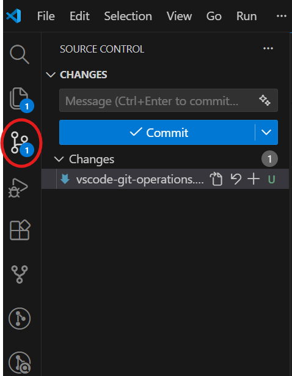

The integrated source control management panel allows you to work with Git via a GUI opposed to typing Git operations in the terminal. Here, you can perform Git operations such as staging files, committing files, pushing/pulling changes, creating branches, viewing differences, resolving merge conflicts, and more! The source control GUI allows for a more visual and "click-ops" approach to using Git. The source control interface syncs with command line Git operations, so you can use them both as you please.

### Source Control Interface Elements

#### 1. Repositories Element

- Displays the name of repositories you currently have opened

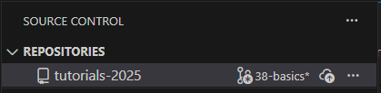

#### 2. Branch Information

- The current branch name is displayed in the bottom status bar of VS Code (screenshot below) and also in the Repositories element (screenshot above)

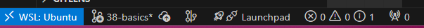

- If you click the name of the branch, which is `38-basics` in this example, options will drop down from the command pallet giving you options to checkout branches or create a new branch:

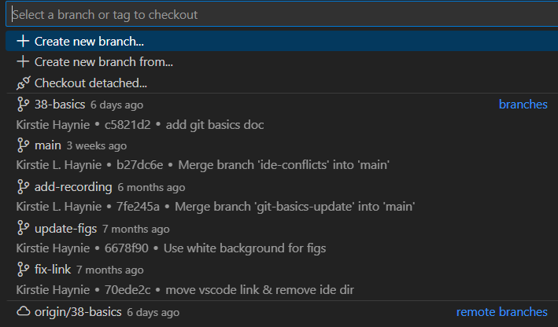

#### 3. Changes Element

- The changes element allows you to review code changes using the terminology below:
  - **M**: Modified files
  - **A**: Added (new) files
  - **D**: Deleted files
  - **U**: Untracked files
  - **C**: Conflicted files

- You can also use this element to stage and commit changes. In the screenshot below, you can see that there are four untracked files and one staged file:

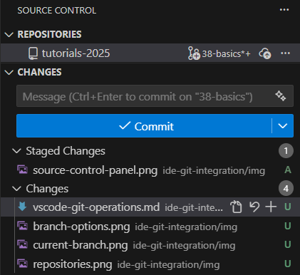

- Staged file changes are ready to be committed. Simply type your commit message into the gray Message box and hit the **✓ Commit** button to finish the commit.

- The Changes element also allows you to perform various git commands. By hovering your mouse on the right of the Changes element and clicking More Actions (three horizontal dots), several source code operations appear, such as `Pull` or `Push`:

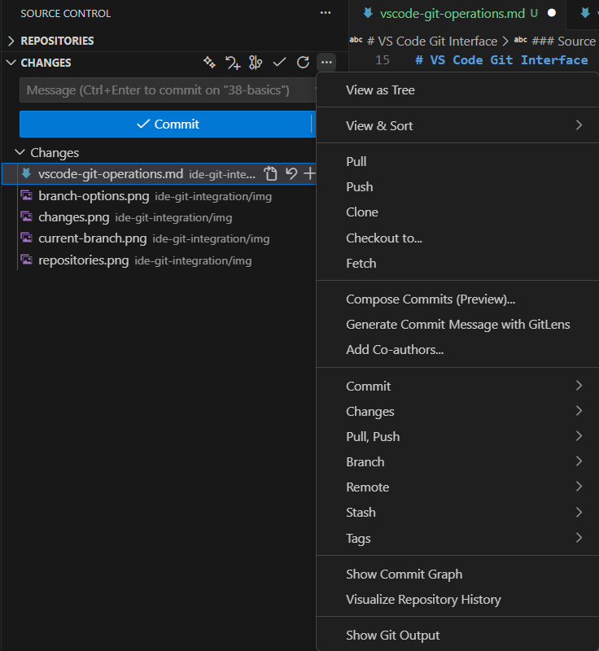

#### 4. Graph Element

- The source control Graph element displays a graphical representation of your commit history and branching relationships

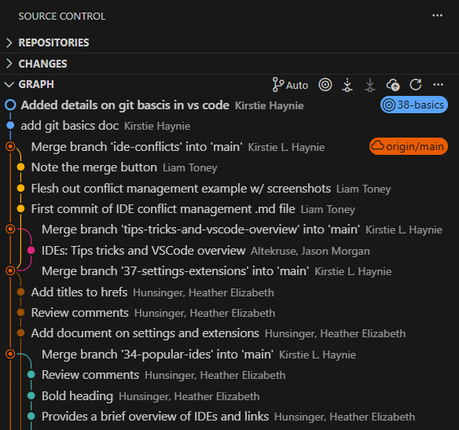

#### 4. Additional Elements

- Additional source code elements may be added when you install an extension. For instance, if you install the Git Lens extension (see [miscellaneous extensions in VS Code Settings and Extensions](./vscode-settings-extensions.md)), a visual representation of Git blame can be accessed.

## Benefits

- Visual representation of changes
- Easy conflict resolution
- Integrated diff viewer
- One-click operations
- No need to memorize commands

# VS Code Integrated Terminal

### How to open the terminal and what is it?

The integrated terminal can be opened via a keyboard shortcut or the menu bar:

- **Shortcuts**:
  - Windows/Linux - <kbd>Ctrl</kbd> + <kbd>+</kbd> + <kbd>`</kbd>
  - Mac - <kbd>⌃</kbd> + <kbd>⇧</kbd> + <kbd>`</kbd>

- **Menu Bar**: In the menu bar go to `Terminal` then click `New Terminal`

This should open a new terminal at the bottom of the VS Code IDE using your operating systems default shell (e.g., PowerShell, Bash). The working directory starts at the root of the workspace folder.

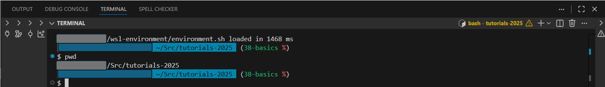

You can run shell commands as you would in your operating systems shell terminal (e.g., Ubuntu terminal, Mac terminal) and if you have Git installed you can also run Git commands. Refer to the [Git Basics tutorial](../git-basics/) to install Git.

Note: this tutorial will not cover basic Unix, Linux, or PowerShell commands.

## Terminal Benefits

- More control and options
- Faster for experienced users
- Better for scripting
- Works in any environment
- Full Git feature access

# Basic Git Operations

## Clone a Repository

Let's start by cloning the (CDI-Software tutorials-2025)[https://code.usgs.gov/cdi/cdi-software/tutorials-2025] repository from GitLab!

Note: if you already have this repository cloned, please either:

1.  rebase/pull the upstream project (all branches),
2.  delete the clone and follow along here, or
3.  follow along by cloning to a new location.

### Source Control Interface

1. Open a new VS Code Window.
2. Open the Source Control Interface.
3. Select "Clone Repository".
4. Paste `https://code.usgs.gov/cdi/cdi-software/tutorials-2025.git` into bar and hit enter.
5. Select where to clone the repository (a Finder/File Explorer window should automatically open). Navigate to where you would like to clone the repository, create an empty folder with name "tutorials-2025", then hit "Select as Repository Destination".
6. A prompt will ask if you would like to open the repository. Select "Open".

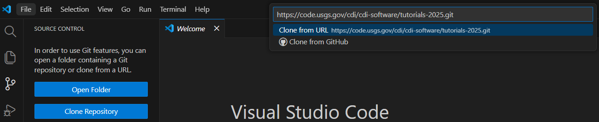

### Integrated Terminal

`git clone https://code.usgs.gov/cdi/cdi-software/tutorials-2025.git`

To clone to a specific location, use:

`git clone https://code.usgs.gov/cdi/cdi-software/tutorials-2025.git /Path/To/Empty/Folder`

Next, open VS Code and open the repository: File --> Open Folder.

## Create a New Branch

Let's create a feature branch that we can work in during this tutorial!

### Source Control Interface

1. In the Source Control Interface, select "More Actions" (three horizontal dots), then select `Branch` --> `Create Branch`.

2) Type `ide-tutorial` for the branch name and hit enter.

Note: you can also hit the current branch name in the bottom status bar or type `Git: Create Branch` in the Command Palette.

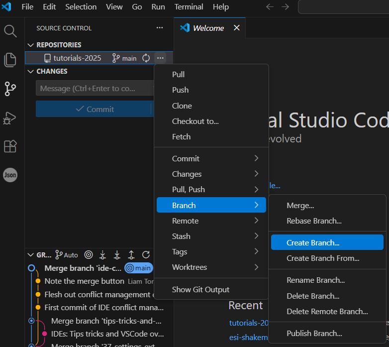

### Integrated Terminal

`git branch -c ide-tutorial`

## Pull

Let's incorporate changes from the `branch-a` branch in our origin repository into our `ide-tutorial`, or feature, branch!

### Source Control Interface

1. In the Source Control Interface, select "More Actions" (three horizontal dots), then select `Pull from...`

2) Select `origin/branch-a`

Note: you can also type `Git: Pull from` in the Command Palette.

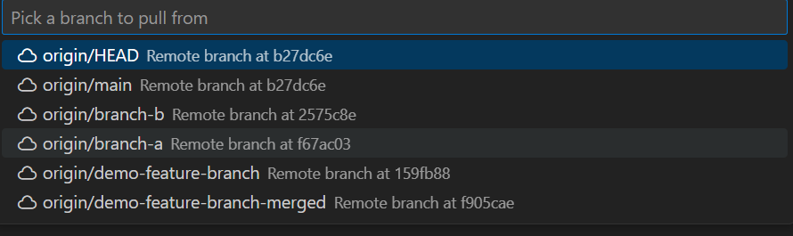

### Integrated Terminal

`git pull origin branch-a`

## View Changes

The changes that we pulled down has a new item in the [README.md](./README.md): `8. Pizza break!!!!!!!!!!`. Let's remove that!

1. Open the [IDE's and Git Integration README.md](./README.md).
2. Delete item 8 and save the file.

Now, lets verify that change by looking at the difference between

### Source Control Interface

1. Once you hit save, the number 1 should appear on top of the Source Control logo. This number indicates how many files have changed.
2. When the Source Control Interface is open, you will see the files that have changed under the `Changes` heading.
3. Click on the `README.md` and a new `Working Tree` window will appear in VS Code and will highlight the change you made.

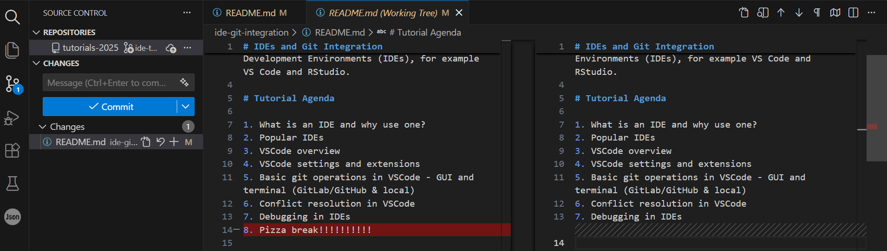

### Integrated Terminal

`git diff`

## Discard Changes

On second thought...a break doesn't sound like a bad idea! Let's discard the change we made.

### Source Control Interface

1. In the Source Control Interface, to the right of the changed file, there is an arrow that when you hoover over it says "Discard Changes". Hit the arrow.
2. A window will pop up asking to confirm this change. Select `Discard File`. This simply removes any changes you made to that file, it does not delete the file.

### Integrated Terminal

`git restore .\ide-git-integration\README.md`

## Stage and Commit

Let's suggest a coffee break instead of pizza and make a commit!

1. Open the [IDE's and Git Integration README.md](./README.md).
2. Replace `Pizza` with `Coffee` in item 8 and save the file.

### Source Control Interface

1. Once the file is saved and you verified the change, in the Source Control Interface hit the `+` option to the right of the changed file. This will stage the file.
2. In the commit box, type your commit message. In the screenshot below, I typed "Switch pizza to coffee break".
3. Hit the `Commit` button.

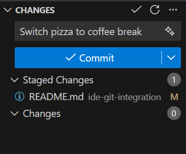

### Integrated Terminal

1. `git add ide-git-integration/README.md`
2. `git commit -m "Switch pizza to coffee break"`

or combine them using `git commit -am "Switch pizza to coffee break"`

## Push

At this point, you may want to push your suggested change to your repository in GitLab and create a merge request to the upstream project so that your changes can be incorporated. The `push` action will not work for us during this tutorial, but let's walk through how to do it anyway!

### Source Control Interface

1. In the Source Control Interface, select "More Actions" (three horizontal dots), then select `Push`.

### Integrated Terminal

`git push origin ide-tutorial`

# Recommendations

1. **Start with the GUI** to understand Git concepts visually
2. **Learn terminal commands** for advanced operations
3. **Use both approaches** depending on the situation
4. **Practice regularly** with real projects! Start with simple operations and gradually work your way up to more complex workflows.
5. **Follow best practices** for commit messages and branching

# References

- [VS Code Source Control Interface Overview][1]

[1]: https://code.visualstudio.com/docs/sourcecontrol/overview "This is a non-Federal link"
