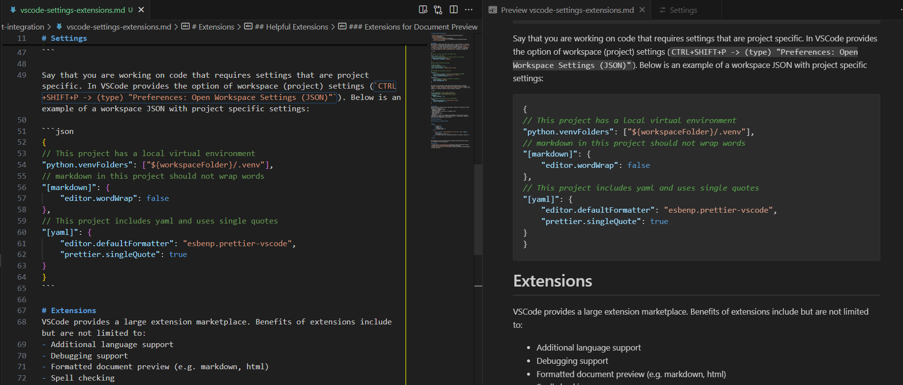
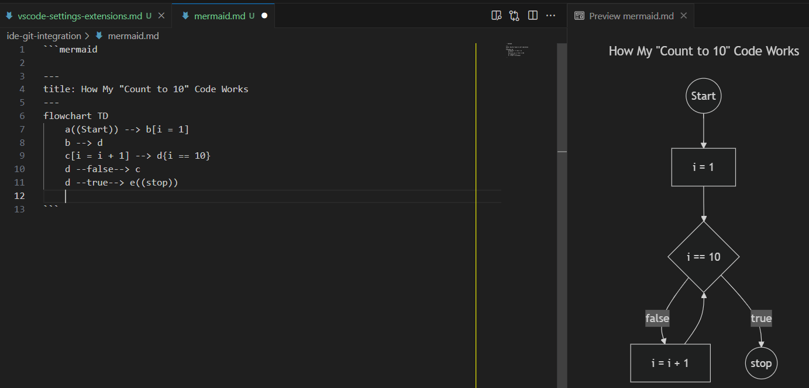
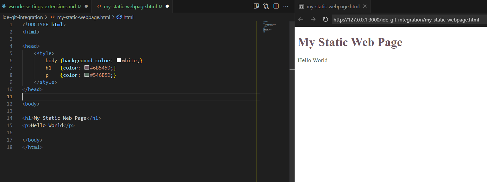
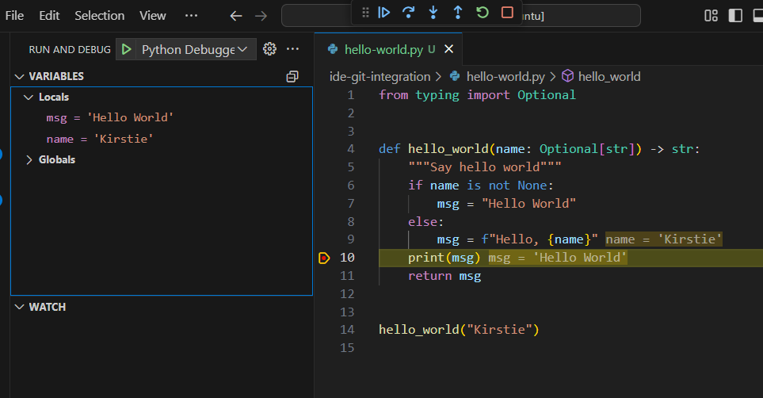
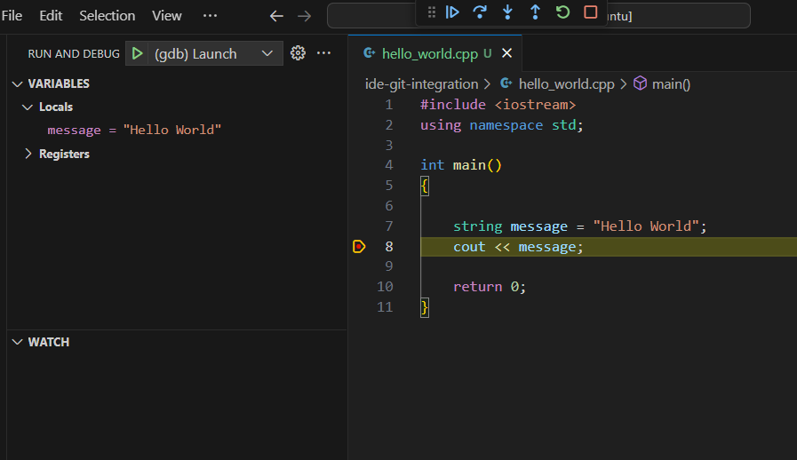
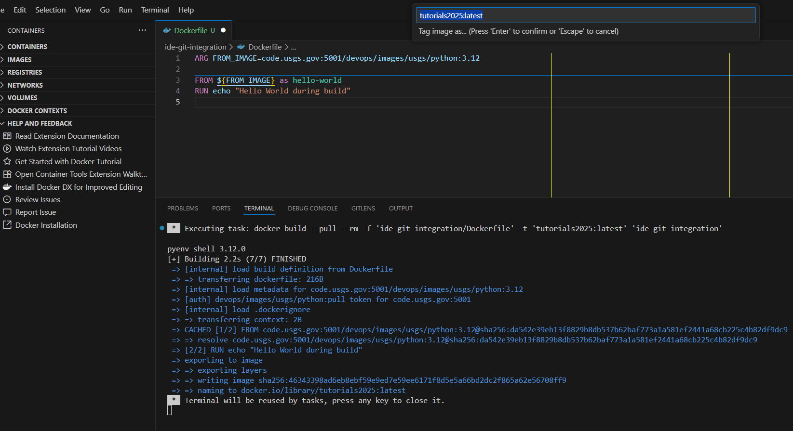
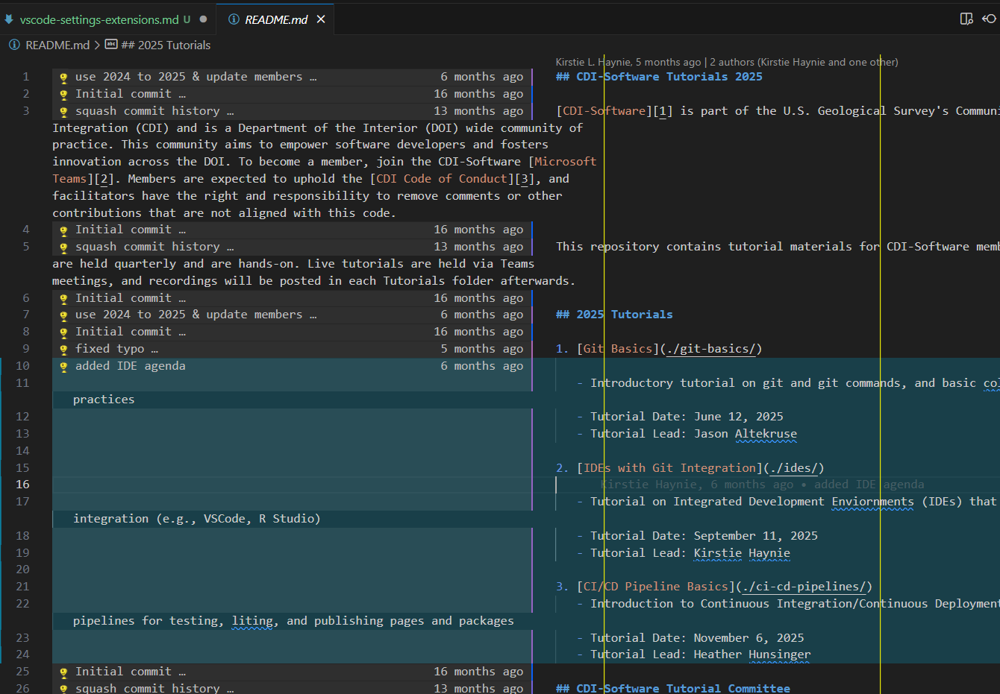
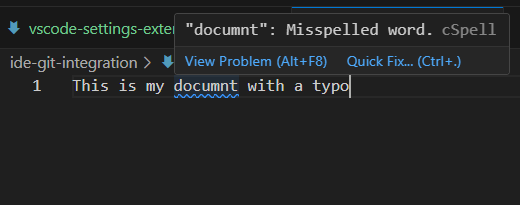

# VSCode Setting and Extensions

- [VSCode Setting and Extensions](#vscode-setting-and-extensions)
- [Settings](#settings)
- [Extensions](#extensions)
  - [Example Extensions](#example-extensions)
    - [Extensions for Formatting](#extensions-for-formatting)
    - [Extensions for Document Preview](#extensions-for-document-preview)
    - [Extensions for Debugging](#extensions-for-debugging)
    - [Miscellaneous Extensions](#miscellaneous-extensions)
  - [Extensions and Settings](#extensions-and-settings)
- [References](#references)

# Settings

One benefit of VSCode (and other popular IDEs) is the portability of settings. While settings can be edited with point and click options (`File -> Preferences -> Settings`), settings can also be defined via a JSON file which can be transferred to any other system where you have VSCode installed (`CTRL+SHIFT+P -> (type) "Preferences: Open User Settings (JSON)"`). Below is an annotated user settings JSON with useful configurations for formatting, linting, etc.

```json
{
  /**
Set rulers so that you know where code should wrap
*/
  "editor.rulers": [80, 120],
  // set custom color for rulers, so that they stand out in dark mode
  "workbench.colorCustomizations": {
    "editorRuler.foreground": "#e8e807"
  },

  /**
Configure default formatting settings
*/
  // when to format
  "editor.formatOnSave": true,
  // what default formatter to use
  "editor.defaultFormatter": "esbenp.prettier-vscode",

  /**
Set language/file type specific settings
*/
  "[python]": {
    // Here we use a different formatter for this specific language
    "editor.defaultFormatter": "ms-python.black-formatter",
    "analysis.autoImportCompletions": true
  },
  "[markdown]": {
    // Automatically wrap text in markdown for readability
    "editor.wordWrap": "bounded",
    "editor.wordWrapColumn": 80
  }
}
```

The above user settings will be applied to all projects (also called workspaces). However, there may be instances where you are working on a project that requires its own specific settings. In VSCode provides the option of workspace (project) settings (`CTRL+SHIFT+P -> (type) "Preferences: Open Workspace Settings (JSON)"`). This will create a file in your current working directory (project/workspace) at `.vscode/settings.json`. These settings will only be applied to the current project and will not impact other projects that are in any higher level directories. Below is an example of a workspace settings.json with project specific settings:

```json
{
  // This project/workspace has a local virtual environment
  "python.venvFolders": ["${workspaceFolder}/.venv"],
  // markdown in this workspace should not wrap words
  "[markdown]": {
    "editor.wordWrap": false
  },
  // This workspace includes yaml and uses single quotes
  "[yaml]": {
    "editor.defaultFormatter": "esbenp.prettier-vscode",
    "prettier.singleQuote": true
  }
}
```

# Extensions

VSCode provides a large extension marketplace. Benefits of extensions include but are not limited to:

- Additional language support
- Debugging support
- Formatted document preview (e.g. markdown, html)
- Spell checking
- Automated docstrings
- Type hints
  > Extensions are part of an opensource marketplace. Do your best to ensure extensions are coming from a trusted source prior to installation. Regularly check that your extensions are up to date.

## Example Extensions

### Extensions for Formatting

<table>
    <tr>
        <td>Icon</td>
        <td>Name</td>
        <td>Features</td>
    </tr> 
    <tr>
        <td> </td>
        <!-- This is a non-Federal link -->
        <td><a href="https://marketplace.visualstudio.com/items?itemName=esbenp.prettier-vscode" title="This is a non-Federal link">Prettier</a></td>
        <td>Consistent style formatting for languages including but not limited to: JavaScript, Typescript, JSON, HTML, Markdown, YAML</td>
    </tr> 
    <tr>
        <td> </td>
        <!-- This is a non-Federal link -->
        <td><a href="https://marketplace.visualstudio.com/items?itemName=ms-python.black-formatter" title="This is a non-Federal link">Black Formatter</a></td>
        <td>Formatting support for Python</td>
    </tr> 
</table>

### Extensions for Document Preview

<table>
    <tr>
        <td>Icon</td>
        <td>Name</td>
        <td>Features</td>
        <td>Example</td>
    </tr> 
    <tr>
        <td> </td>
        <!-- This is a non-Federal link -->
        <td><a href="https://marketplace.visualstudio.com/items?itemName=yzhang.markdown-all-in-one" title="This is a non-Federal link">Markdown All in One</a></td>
        <td>Shortcuts, auto-generated table of contents, preview</td>
        <td> </td>
    </tr> 
    <tr>
        <td> </td>
        <!-- This is a non-Federal link -->
        <td><a href="https://marketplace.visualstudio.com/items?itemName=bierner.markdown-mermaid" title="This is a non-Federal link">Markdown Preview Mermaid Support</a></td>
        <td>Preview for mermaid diagrams (can be used in GitHub/GitLab markdown documentation files)</td>
        <td> </td>
    </tr>
        <tr>
        <td> </td>
        <!-- This is a non-Federal link -->
        <td><a href="https://marketplace.visualstudio.com/items?itemName=ms-vscode.live-server" title="This is a non-Federal link">Live Preview</a></td>
        <td>Webpage preview, autocompletion for elements</td>
        <td> </td>
    </tr>
</table>

### Extensions for Debugging

<table>
    <tr>
        <td>Icon</td>
        <td>Name</td>
        <td>Features</td>
        <td>Example</td>
    </tr>
    <tr>
        <td> </td>
        <!-- This is a non-Federal link -->
        <td><a href="https://marketplace.visualstudio.com/items?itemName=ms-python.python" title="This is a non-Federal link">Python</a></td>
        <td>Pylance, debugging, formatting/linting, auto-completion, virtual environment management</td>
        <td> </td>
    </tr>
    <tr>
        <td> </td>
        <!-- This is a non-Federal link -->
        <td><a href="https://marketplace.visualstudio.com/items?itemName=ms-vscode.cpptools" title="This is a non-Federal link">C/C++</a></td>
        <td>Compiler, debugger, intellisense</td>
        <td> </td>
    </tr>
    <tr>
        <td> </td>
        <!-- This is a non-Federal link -->
        <td><a href="https://marketplace.visualstudio.com/items?itemName=vscjava.vscode-java-debug" title="This is a non-Federal link">Debugger for Java</a></td>
        <td>Integrated java debugger</td>
        <!-- This is a non-Federal link -->
        <td><a href='https://code.visualstudio.com/docs/java/java-debugging' title="This is a non-Federal link">Java Debugging Documentation</a></td>
    </tr>
    <tr>
        <td> </td>
        <!-- This is a non-Federal link -->
        <td><a href="https://marketplace.visualstudio.com/items?itemName=ms-azuretools.vscode-containers" title="This is a non-Federal link">Container Tools</a></td>
        <td>Auto-completion, syntax highlighting, management and debugging</td>
        <td> </td>
    </tr>
</table>

### Miscellaneous Extensions

<table>
    <tr>
        <td>Icon</td>
        <td>Name</td>
        <td>Features</td>
        <td>Example</td>
    </tr>
    <tr>
        <td> </td>
        <!-- This is a non-Federal link -->
        <td><a href="https://marketplace.visualstudio.com/items?itemName=eamodio.gitlens" title="This is a non-Federal link">GitLens — Git supercharged</a></td>
        <td>In editor blames</td>
        <td> </td>
    </tr>
    <tr>
        <td> </td>
        <!-- This is a non-Federal link -->
        <td><a href="https://marketplace.visualstudio.com/items?itemName=streetsidesoftware.code-spell-checker" title="This is a non-Federal link">Code Spell Checker</a></td>
        <td>Spell check for code and documents</td>
        <td> </td>
    </tr>
</table>

## Extensions and Settings

The extensions you have installed may have more default settings options that you can configure in your settings.json. For example, you may want the spell checker extension to ignore specific words. If so, you can update your settings.json as follows:

```json
{
  // dictionary so that spell checker doesn't label words as misspelled
  "cSpell.userWords": ["USGS"]
}
```

# References

- [Comparing user and workspace settings][1]
- [VSCode Python settings reference][2]

[1]: https://code.visualstudio.com/docs/configure/settings?originUrl=%2Fdocs%2Fconfigure%2Fsettings "This is a non-Federal link"
[2]: https://code.visualstudio.com/docs/python/settings-reference "This is a non-Federal link"
