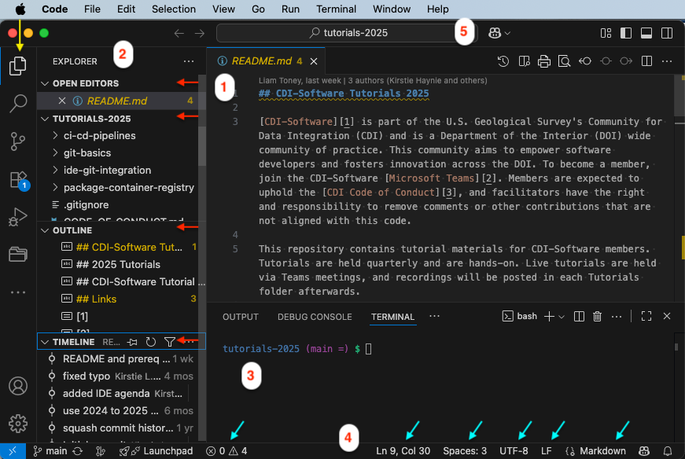
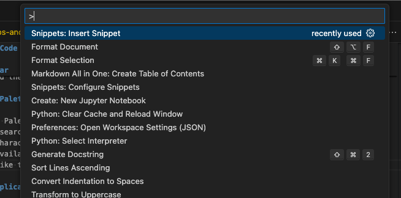
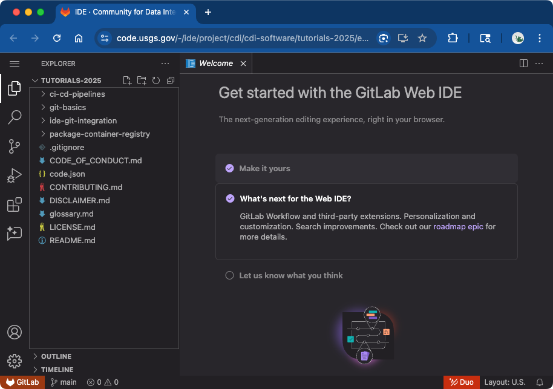
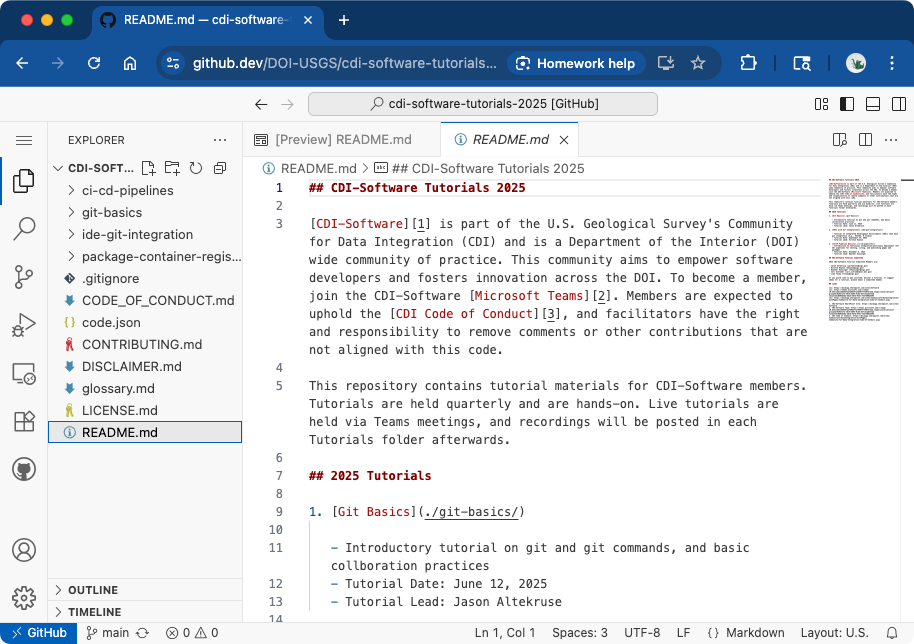

# Visual Studio Code

[Visual Studio Code][ms-vs-code] is a modern and very popular IDE (commonly referred to as VS Code),
packged by Microsoft but based on the open source [Code OSS][code-oss] IDE project. Other IDEs are
also based on Code OSS, such as [Positron][positron-ide] (from the RStudio folks).

VS Code is available as a [desktop application](#vs-code-window) as well as a
[web application](#vs-code-web-applications).

## VS Code Window

The main VS Code window is an editor (1), with a side panel (2), terminal (3), and a status bar (4).
The powerful command palette (5) provides access to all functionality within VS Code, including
keyboard shortcuts for most operations.

### (1) Editor

The VS Code editor has tabs for for multiple open documents. The editor window can be split
horizontally or vertically to view one or more documents side-by-side.

### (2) Side panel

The VS Code side panel (2) can be expanded or hidden, or moved to the right or left side of the
window. The side panel may have different panes based on installed extensions or enabled features.
The basic Explorer shows (red arrows, top to bottom) the open editors, any folders opened in the
current workspace, an outline of the document (this could be headings in a Markdown document or
variables, classes, and functions in a Python file), and, if applicable, the git history for the
current document.

#### Other side panels

The side panel icons below the Explorer icon (yellow arrow) are the Search panel (Cmd+Shift+F [Mac]
or Ctrl+Shift+F [PC/Linux]), the Source Control panel, the Extensions panel, the Run and Debug
panel, and the Project Manager panel. There may be more panels depending on installed extensions.
At the bottom is the Accounts panel and the Manage panel (application settings, command palette,
etc.).

### (3) Terminal

VS Code supports various terminals and consoles depending on the system. It can be configured to use
your system preferences and configurations (e.g. `~/.bash_profile`). A key benefit is that it is
integrated with the editor. For example, if you run a Python program on the command line and an
error is thrown, command-clicking the error message stack trace will open the referenced line of
code in the editor.

### (4) Status bar

The VS Code status bar provides a lot of useful information and functionality (depending on the
active documents or workspace). The basic status bar (blue arrows, left to right), shows any errors
or warnings (e.g. Markdown lint issues), the line and column position of the cursor, indentation
setting for the current document (tabs vs. spaces, and the size of tabs), the encoding of the
current file, and the language mode for the current document.

### (5) Command Palette

VS Code's Command Palette is accessed with Cmd+Shift+P (Mac) or Ctrl+Shift+P (PC/Linux), or by
clicking in the search field at the top of the VS Code window. When you open the the command palette
there is a ">" character - delete this to see a list of available actions. Or, start typing after
the ">" to see available commands, such as VS Code settings, extension settings, or actions. Actions
include things like trim spaces, transform characters to uppercase, format selection or document.

## VS Code Web Applications

Both GitLab and GitHub offer VS Code as an in-browser web application. The web applications have the
same layout as the desktop application with an editor, side panel, and status bar. The terminal is
not available in the GitLab VS Code but the terminal can be used in the GitHub VS Code within a
GitHub Codespace, which is beyond the scope of this tutorial.

GitLab VS Code IDE

Open a GitLab repository in the VS Code web application using one of the following methods:

- Open the repository in the current browser tab by typing `.` or in a new tab by typing `>`
- While viewing the repository, use the `Code ▾` button and click to open with Web IDE

 

GitHub VS Code IDE

Open a GitHub repository in the VS Code web application, "github.dev", using any of the following
methods:

- Open the repository in the current browser tab by typing `.` or in a new tab by typing `>`
- Change `github.com` in the URL to `github.dev`
- When viewing a file, select the ▾ dropdown menu and click "github.dev".

 

[code-oss]: https://github.com/microsoft/vscode "Not a Federal Link"
[ms-vs-code]: https://code.visualstudio.com/ "Not a Federal Link"
[positron-ide]: https://positron.posit.co/ "Not a Federal Link"

---

## Tutorial Pages

1. [What is an IDE and why use one?](./what-is-an-ide.md)
2. [Popular IDEs](./popular-ides.md)
3. [VS Code overview](./vscode.md)
4. [VS Code settings and extensions](./vscode-settings-extensions.md)
5. [Basic git operations in VS Code](./vscode-git-operations.md)
6. [Conflict resolution in VS Code](vscode-conflict-management.md)

---
